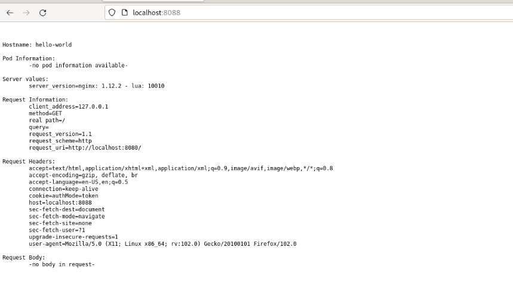
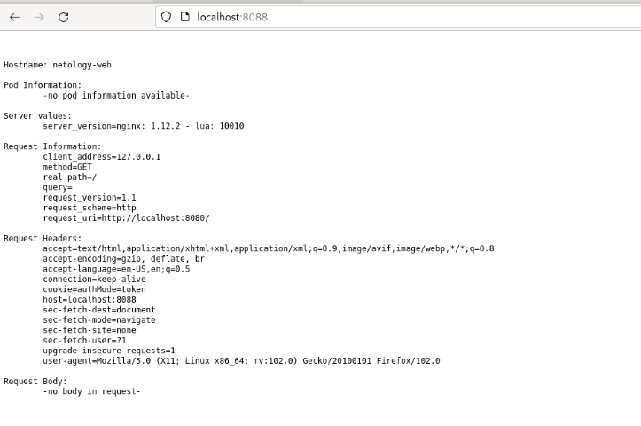

# Домашнее задание к занятию «Базовые объекты K8S»

## Задача 
<details> <summary> . </summary>
### Цель задания

В тестовой среде для работы с Kubernetes, установленной в предыдущем ДЗ, необходимо развернуть Pod с приложением и подключиться к нему со своего локального компьютера. 

------

### Чеклист готовности к домашнему заданию

1. Установленное k8s-решение (например, MicroK8S).
2. Установленный локальный kubectl.
3. Редактор YAML-файлов с подключенным Git-репозиторием.

------

### Инструменты и дополнительные материалы, которые пригодятся для выполнения задания

1. Описание [Pod](https://kubernetes.io/docs/concepts/workloads/pods/) и примеры манифестов.
2. Описание [Service](https://kubernetes.io/docs/concepts/services-networking/service/).

------

### Задание 1. Создать Pod с именем hello-world

1. Создать манифест (yaml-конфигурацию) Pod.
2. Использовать image - gcr.io/kubernetes-e2e-test-images/echoserver:2.2.
3. Подключиться локально к Pod с помощью `kubectl port-forward` и вывести значение (curl или в браузере).

------

### Задание 2. Создать Service и подключить его к Pod

1. Создать Pod с именем netology-web.
2. Использовать image — gcr.io/kubernetes-e2e-test-images/echoserver:2.2.
3. Создать Service с именем netology-svc и подключить к netology-web.
4. Подключиться локально к Service с помощью `kubectl port-forward` и вывести значение (curl или в браузере).

------

### Правила приёма работы

1. Домашняя работа оформляется в своем Git-репозитории в файле README.md. Выполненное домашнее задание пришлите ссылкой на .md-файл в вашем репозитории.
2. Файл README.md должен содержать скриншоты вывода команд `kubectl get pods`, а также скриншот результата подключения.
3. Репозиторий должен содержать файлы манифестов и ссылки на них в файле README.md.

------

### Критерии оценки
Зачёт — выполнены все задания, ответы даны в развернутой форме, приложены соответствующие скриншоты и файлы проекта, в выполненных заданиях нет противоречий и нарушения логики.

На доработку — задание выполнено частично или не выполнено, в логике выполнения заданий есть противоречия, существенные недостатки.

</details>
#


> # Решения:
>

## Задание 1 Создать Pod с именем hello-world
1. 
```yaml
apiVersion: v1
kind: Pod
metadata:
  name: hello-world
spec:
  containers:
  - name: hello-world
    image: gcr.io/kubernetes-e2e-test-images/echoserver:2.2
    ports:
    - containerPort: 8080
```

2. 
```bash
ubuntu@ubuntu2004:~/other/kuber_1-2/src$ kubectl apply -f my_pod.yaml 
pod/hello-world created
ubuntu@ubuntu2004:~/other/kuber_1-2/src$ kubectl get pods -o wide
NAME          READY   STATUS    RESTARTS   AGE   IP             NODE          NOMINATED NODE   READINESS GATES
hello-world   1/1     Running   0          6s    10.1.123.143   netology-01   <none>           <none>
```

3. 
```bash
ubuntu@ubuntu2004:~/other/kuber_1-2/src$ kubectl port-forward hello-world 8088:8080
Forwarding from 127.0.0.1:8088 -> 8080
Forwarding from [::1]:8088 -> 8080
Handling connection for 8088
```

#

## Задание 2. Создать Service и подключить его к Pod
1.  
```yaml
apiVersion: v1
kind: Pod
metadata:
  name: netology-web
  labels:
    app: netology
spec:
  containers:
  - name: netology-web
    image: gcr.io/kubernetes-e2e-test-images/echoserver:2.2
```
2. 
```bash
ubuntu@ubuntu2004:~/other/kuber_1-2/src$ kubectl get pods -o wide
NAME           READY   STATUS    RESTARTS   AGE   IP             NODE          NOMINATED NODE   READINESS GATES
hello-world    1/1     Running   0          26m   10.1.123.143   netology-01   <none>           <none>
netology-web   1/1     Running   0          7s    10.1.123.145   netology-01   <none>           <none>
```
3. 
```yaml
apiVersion: v1
kind: Service
metadata:
  name: netology-svc
spec:
  ports:
    - name: wed
      port: 8080
  selector:
    app: netology
```
```bash
ubuntu@ubuntu2004:~/other/kuber_1-2/src$ kubectl describe svc netology-svc
Name:              netology-svc
Namespace:         default
Labels:            <none>
Annotations:       <none>
Selector:          app=netology
Type:              ClusterIP
IP Family Policy:  SingleStack
IP Families:       IPv4
IP:                10.152.183.71
IPs:               10.152.183.71
Port:              wed  8080/TCP
TargetPort:        8080/TCP
Endpoints:         10.1.123.145:8080
Session Affinity:  None
Events:            <none>
ubuntu@ubuntu2004:~/other/kuber_1-2/src$ kubectl get svc -o wide
NAME           TYPE        CLUSTER-IP      EXTERNAL-IP   PORT(S)    AGE     SELECTOR
kubernetes     ClusterIP   10.152.183.1    <none>        443/TCP    3d5h    <none>
netology-svc   ClusterIP   10.152.183.71   <none>        8080/TCP   6m44s   app=netology
```
4. 
```bash
ubuntu@ubuntu2004:~/other/kuber_1-2/src$ kubectl port-forward svc/netology-svc 8088:8080
Forwarding from 127.0.0.1:8088 -> 8080
Forwarding from [::1]:8088 -> 8080
```
```bash
ubuntu@ubuntu2004:~/other/kuber_1-2$ curl localhost:8088


Hostname: netology-web

Pod Information:
        -no pod information available-

Server values:
        server_version=nginx: 1.12.2 - lua: 10010

Request Information:
        client_address=127.0.0.1
        method=GET
        real path=/
        query=
        request_version=1.1
        request_scheme=http
        request_uri=http://localhost:8080/

Request Headers:
        accept=*/*  
        host=localhost:8088  
        user-agent=curl/7.74.0  

Request Body:
        -no body in request-
```


#