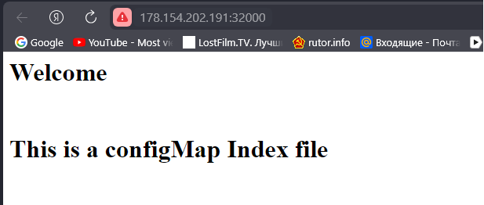
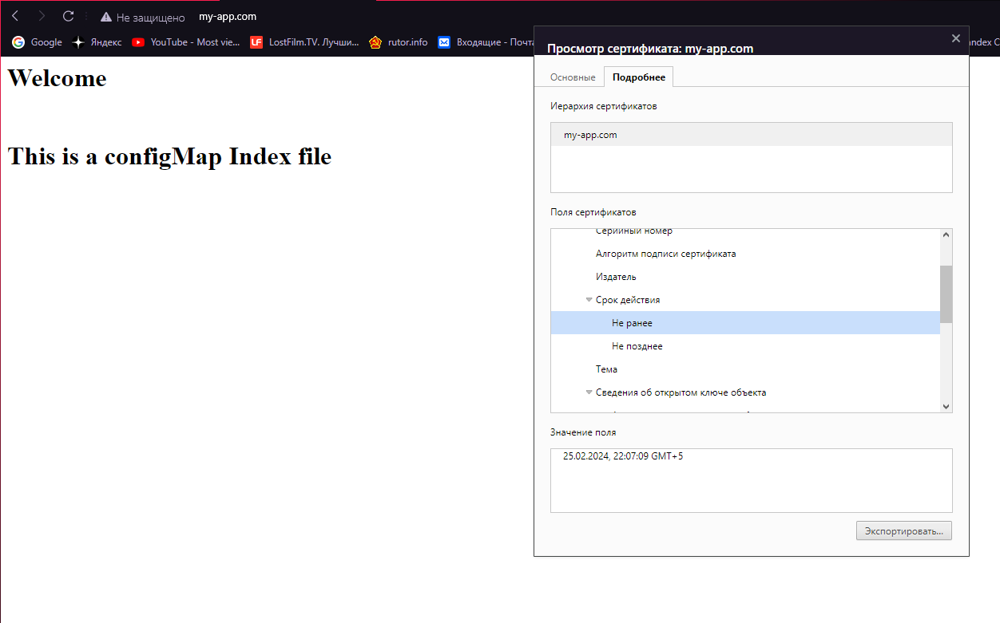

# Домашнее задание к занятию «Конфигурация приложений»

> ## Задания:

<details> <summary> . </summary>
### Цель задания

В тестовой среде Kubernetes необходимо создать конфигурацию и продемонстрировать работу приложения.

------

### Чеклист готовности к домашнему заданию

1. Установленное K8s-решение (например, MicroK8s).
2. Установленный локальный kubectl.
3. Редактор YAML-файлов с подключённым GitHub-репозиторием.

------

### Инструменты и дополнительные материалы, которые пригодятся для выполнения задания

1. [Описание](https://kubernetes.io/docs/concepts/configuration/secret/) Secret.
2. [Описание](https://kubernetes.io/docs/concepts/configuration/configmap/) ConfigMap.
3. [Описание](https://github.com/wbitt/Network-MultiTool) Multitool.

------

### Задание 1. Создать Deployment приложения и решить возникшую проблему с помощью ConfigMap. Добавить веб-страницу

1. Создать Deployment приложения, состоящего из контейнеров nginx и multitool.
2. Решить возникшую проблему с помощью ConfigMap.
3. Продемонстрировать, что pod стартовал и оба конейнера работают.
4. Сделать простую веб-страницу и подключить её к Nginx с помощью ConfigMap. Подключить Service и показать вывод curl или в браузере.
5. Предоставить манифесты, а также скриншоты или вывод необходимых команд.

------

### Задание 2. Создать приложение с вашей веб-страницей, доступной по HTTPS 

1. Создать Deployment приложения, состоящего из Nginx.
2. Создать собственную веб-страницу и подключить её как ConfigMap к приложению.
3. Выпустить самоподписной сертификат SSL. Создать Secret для использования сертификата.
4. Создать Ingress и необходимый Service, подключить к нему SSL в вид. Продемонстировать доступ к приложению по HTTPS. 
4. Предоставить манифесты, а также скриншоты или вывод необходимых команд.

------

### Правила приёма работы

1. Домашняя работа оформляется в своём GitHub-репозитории в файле README.md. Выполненное домашнее задание пришлите ссылкой на .md-файл в вашем репозитории.
2. Файл README.md должен содержать скриншоты вывода необходимых команд `kubectl`, а также скриншоты результатов.
3. Репозиторий должен содержать тексты манифестов или ссылки на них в файле README.md.

------

</details>


> ## Решения:
>
###  Задание 1.

Создадим namespace задания:
```bash
ubuntu@ubuntu2004:~/other/kuber_2-3$ kubectl create ns dz2-3
namespace/dz2-3 created

ubuntu@ubuntu2004:~/other/kuber_2-3$ kubectl get ns
NAME              STATUS   AGE
kube-system       Active   12d
kube-public       Active   12d
kube-node-lease   Active   12d
default           Active   12d
ingress           Active   9d
dz2-3             Active   4s
```


Поднимаем сервис:
```bash
ubuntu@ubuntu2004:~/other/kuber_2-3/scr/nginx_multitool$ kubectl apply -f service.yaml 
service/deployment-service created

ubuntu@ubuntu2004:~/other/kuber_2-3/scr/nginx_multitool$ kubectl get service -n dz2-3
NAME                 TYPE       CLUSTER-IP      EXTERNAL-IP   PORT(S)                       AGE
deployment-service   NodePort   10.152.183.54   <none>        80:32000/TCP,8080:32001/TCP   18s
```

Поднимаем configMap:
```bash
ubuntu@ubuntu2004:~/other/kuber_2-3/scr/nginx_multitool$ kubectl apply -f configmap.yaml 
configmap/configmap-nginx-multitool created

ubuntu@ubuntu2004:~/other/kuber_2-3/scr/nginx_multitool$ kubectl get cm -n dz2-3
NAME                        DATA   AGE
kube-root-ca.crt            1      86m
configmap-nginx-multitool   2      14s
```

Поднимаем deployment:
```bash
ubuntu@ubuntu2004:~/other/kuber_2-3/scr/nginx_multitool$ kubectl apply -f deployment.yaml 
deployment.apps/netology-deployment created

ubuntu@ubuntu2004:~/other/kuber_2-3/scr/nginx_multitool$ kubectl get pods -n dz2-3
NAME                                   READY   STATUS    RESTARTS   AGE
netology-deployment-7c69cd8746-9mlf8   2/2     Running   0          19s
```

```bash
ubuntu@ubuntu2004:~/other/kuber_2-3/scr/nginx_multitool$ kubectl describe pod netology-deployment-7c69cd8746-9mlf8 -n dz2-3
Name:             netology-deployment-7c69cd8746-9mlf8
Namespace:        dz2-3
Priority:         0
Service Account:  default
Node:             netology-01/192.168.101.26
Start Time:       Sun, 25 Feb 2024 21:36:32 +0500
Labels:           app=main
                  pod-template-hash=7c69cd8746
Annotations:      cni.projectcalico.org/containerID: 43a27b578311c650901ac62c8cfbc4fc70e677c1ee28dfc74c4d799928cabba7
                  cni.projectcalico.org/podIP: 10.1.123.168/32
                  cni.projectcalico.org/podIPs: 10.1.123.168/32
Status:           Running
IP:               10.1.123.168
IPs:
  IP:           10.1.123.168
Controlled By:  ReplicaSet/netology-deployment-7c69cd8746
Containers:
  nginx:
    Container ID:   containerd://d0116131a8d5e2c0ecf1eab67e0ffb5dfabd85876a55964bbf6be87d3301978e
    Image:          nginx:1.19.2
    Image ID:       docker.io/library/nginx@sha256:c628b67d21744fce822d22fdcc0389f6bd763daac23a6b77147d0712ea7102d0
    Port:           <none>
    Host Port:      <none>
    State:          Running
      Started:      Sun, 25 Feb 2024 21:36:33 +0500
    Ready:          True
    Restart Count:  0
    Environment:    <none>
    Mounts:
      /usr/share/nginx/html/ from nginx-index-file (rw)
      /var/run/secrets/kubernetes.io/serviceaccount from kube-api-access-wjfp8 (ro)
  multitool:
    Container ID:   containerd://a1baf84e2dfe758739fe67a5b7af8559f73afc680a8c4bbb0d2342ed2a032087
    Image:          wbitt/network-multitool
    Image ID:       docker.io/wbitt/network-multitool@sha256:d1137e87af76ee15cd0b3d4c7e2fcd111ffbd510ccd0af076fc98dddfc50a735
    Port:           <none>
    Host Port:      <none>
    State:          Running
      Started:      Sun, 25 Feb 2024 21:36:35 +0500
    Ready:          True
    Restart Count:  0
    Environment:
      HTTP_PORT:  <set to the key 'HTTP-PORT' of config map 'configmap-nginx-multitool'>  Optional: false
    Mounts:
      /var/run/secrets/kubernetes.io/serviceaccount from kube-api-access-wjfp8 (ro)
Conditions:
  Type              Status
  Initialized       True 
  Ready             True 
  ContainersReady   True 
  PodScheduled      True 
Volumes:
  nginx-index-file:
    Type:      ConfigMap (a volume populated by a ConfigMap)
    Name:      configmap-nginx-multitool
    Optional:  false
  kube-api-access-wjfp8:
    Type:                    Projected (a volume that contains injected data from multiple sources)
    TokenExpirationSeconds:  3607
    ConfigMapName:           kube-root-ca.crt
    ConfigMapOptional:       <nil>
    DownwardAPI:             true
QoS Class:                   BestEffort
Node-Selectors:              <none>
Tolerations:                 node.kubernetes.io/not-ready:NoExecute op=Exists for 300s
                             node.kubernetes.io/unreachable:NoExecute op=Exists for 300s
Events:
  Type    Reason     Age   From               Message
  ----    ------     ----  ----               -------
  Normal  Scheduled  97s   default-scheduler  Successfully assigned dz2-3/netology-deployment-7c69cd8746-9mlf8 to netology-01
  Normal  Pulled     96s   kubelet            Container image "nginx:1.19.2" already present on machine
  Normal  Created    96s   kubelet            Created container nginx
  Normal  Started    96s   kubelet            Started container nginx
  Normal  Pulling    96s   kubelet            Pulling image "wbitt/network-multitool"
  Normal  Pulled     95s   kubelet            Successfully pulled image "wbitt/network-multitool" in 1.308s (1.308s including waiting)
  Normal  Created    94s   kubelet            Created container multitool
  Normal  Started    94s   kubelet            Started container multitool
```

Проверяем curl: 
```bash
ubuntu@ubuntu2004:~/other/kuber_2-3/scr/nginx_multitool$ curl 178.154.202.191:32000
<html>
<h1>Welcome</h1>
</br>
<h1>This is a configMap Index file</h1>
</html>

ubuntu@ubuntu2004:~/other/kuber_2-3/scr/nginx_multitool$ curl 178.154.202.191:32001
WBITT Network MultiTool (with NGINX) - netology-deployment-7c69cd8746-9mlf8 - 10.1.123.168 - HTTP: 8080 , HTTPS: 443 . (Formerly praqma/network-multitool)
```
И через браузер:


Ссылка на манифест Deployment - https://github.com/R-Gennadi/devops-netology/blob/main/12-Kubernetes/kuber_2-3/file/scr/nginx_multitool/deployment.yaml 

Ссылка на манифест Service - https://github.com/R-Gennadi/devops-netology/blob/main/12-Kubernetes/kuber_2-3/file/scr/nginx_multitool/service.yaml

Ссылка на манифест ConfigMap - https://github.com/R-Gennadi/devops-netology/blob/main/12-Kubernetes/kuber_2-3/file/scr/nginx_multitool/configmap.yaml

------

### Задание 2. Создать приложение с вашей веб-страницей, доступной по HTTPS 


Выпустить самоподписной сертификат SSL. Создать Secret для использования сертификата.
```bash
root@netology-01:~# openssl req -x509 -newkey rsa:4096 -sha256 -nodes -keyout tls.key -out tls.crt -subj "/CN=my-app.com" -days 365
Generating a RSA private key
.................................................................................++++
..........................................................++++
writing new private key to 'tls.key'
-----

root@netology-01:~# ls
snap  tls.crt  tls.key
```

Создать Ingress и необходимый Service, подключить к нему SSL в вид. Продемонстрировать доступ к приложению по HTTPS.
Создаем ```secret```:
```bash
ubuntu@ubuntu2004:~/other/kuber_2-3/scr/nginx_HTTPS$ kubectl create secret tls secret-tls --cert=cert/tls.crt --key=cert/tls.key --namespace=dz2-3
secret/secret-tls created
```
```bash
ubuntu@ubuntu2004:~/other/kuber_2-3/scr/nginx_HTTPS$ kubectl get secret -o yaml -n dz2-3
```
Запускаем все и проверяем:
```bash
ubuntu@ubuntu2004:~/other/kuber_2-3/scr/nginx_HTTPS$ kubectl apply -f configmap_https.yaml 
configmap/configmap-nginx-multitool created

ubuntu@ubuntu2004:~/other/kuber_2-3/scr/nginx_HTTPS$ kubectl apply -f service_https.yaml 
service/service-https created

ubuntu@ubuntu2004:~/other/kuber_2-3/scr/nginx_HTTPS$ kubectl apply -f ingress_https.yaml 
ingress.networking.k8s.io/ingress-https created

ubuntu@ubuntu2004:~/other/kuber_2-3/scr/nginx_HTTPS$ kubectl apply -f deployment_https.yaml 
deployment.apps/netology-deployment created

ubuntu@ubuntu2004:~/other/kuber_2-3/scr/nginx_HTTPS$ kubectl get all -n dz2-3
NAME                                       READY   STATUS    RESTARTS   AGE
pod/netology-deployment-5cdd68d99f-zskp8   1/1     Running   0          14s

NAME                    TYPE       CLUSTER-IP       EXTERNAL-IP   PORT(S)        AGE
service/service-https   NodePort   10.152.183.245   <none>        80:32000/TCP   28s

NAME                                  READY   UP-TO-DATE   AVAILABLE   AGE
deployment.apps/netology-deployment   1/1     1            1           14s

NAME                                             DESIRED   CURRENT   READY   AGE
replicaset.apps/netology-deployment-5cdd68d99f   1         1         1       14s
```
Прописываем DNS my-app.com в файл ```hosts``` и проверяем доступность измененной страницы:
```bash
ubuntu@ubuntu2004:~/other/kuber_2-3/scr/nginx_HTTPS$ curl -k https://my-app.com
<html>
<h1>Welcome</h1>
</br>
<h1>This is a configMap Index file</h1>
</html>
```
И в браузере:


Ссылка на манифест Deployment - https://github.com/R-Gennadi/devops-netology/blob/main/12-Kubernetes/kuber_2-3/file/scr/nginx_HTTPS/deployment_https.yaml

Ссылка на манифест ConfigMap - https://github.com/R-Gennadi/devops-netology/blob/main/12-Kubernetes/kuber_2-3/file/scr/nginx_HTTPS/configmap_https.yaml

Ссылка на манифест Service - https://github.com/R-Gennadi/devops-netology/blob/main/12-Kubernetes/kuber_2-3/file/scr/nginx_HTTPS/service_https.yaml

Ссылка на манифест Ingress - https://github.com/R-Gennadi/devops-netology/blob/main/12-Kubernetes/kuber_2-3/file/scr/nginx_HTTPS/ingress_https.yaml

------