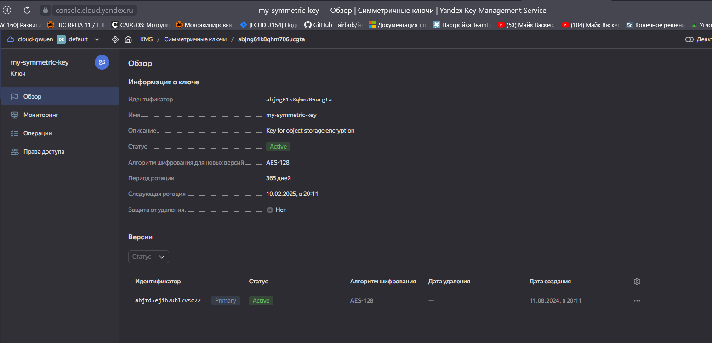
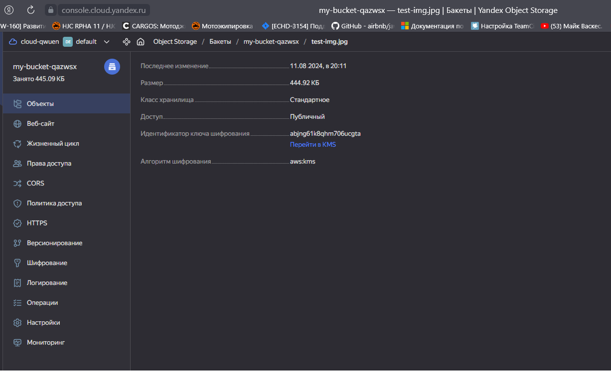

# Домашнее задание к занятию «Безопасность в облачных провайдерах»  

> ## Задания:

<details> <summary> . </summary>
### Цель задания
------
Используя конфигурации, выполненные в рамках предыдущих домашних заданий, нужно добавить возможность шифрования бакета.

---
## Задание 1. Yandex Cloud   

1. С помощью ключа в KMS необходимо зашифровать содержимое бакета:

 - создать ключ в KMS;
 - с помощью ключа зашифровать содержимое бакета, созданного ранее.
2. (Выполняется не в Terraform)* Создать статический сайт в Object Storage c собственным публичным адресом и сделать доступным по HTTPS:

 - создать сертификат;
 - создать статическую страницу в Object Storage и применить сертификат HTTPS;
 - в качестве результата предоставить скриншот на страницу с сертификатом в заголовке (замочек).

Полезные документы:

- [Настройка HTTPS статичного сайта](https://cloud.yandex.ru/docs/storage/operations/hosting/certificate).
- [Object Storage bucket](https://registry.terraform.io/providers/yandex-cloud/yandex/latest/docs/resources/storage_bucket).
- [KMS key](https://registry.terraform.io/providers/yandex-cloud/yandex/latest/docs/resources/kms_symmetric_key).

--- 
## Задание 2*. AWS (задание со звёздочкой)

Это необязательное задание. Его выполнение не влияет на получение зачёта по домашней работе.

**Что нужно сделать**

1. С помощью роли IAM записать файлы ЕС2 в S3-бакет:
 - создать роль в IAM для возможности записи в S3 бакет;
 - применить роль к ЕС2-инстансу;
 - с помощью bootstrap-скрипта записать в бакет файл веб-страницы.
2. Организация шифрования содержимого S3-бакета:

 - используя конфигурации, выполненные в домашнем задании из предыдущего занятия, добавить к созданному ранее бакету S3 возможность шифрования Server-Side, используя общий ключ;
 - включить шифрование SSE-S3 бакету S3 для шифрования всех вновь добавляемых объектов в этот бакет.

3. *Создание сертификата SSL и применение его к ALB:

 - создать сертификат с подтверждением по email;
 - сделать запись в Route53 на собственный поддомен, указав адрес LB;
 - применить к HTTPS-запросам на LB созданный ранее сертификат.

Resource Terraform:

- [IAM Role](https://registry.terraform.io/providers/hashicorp/aws/latest/docs/resources/iam_role).
- [AWS KMS](https://registry.terraform.io/providers/hashicorp/aws/latest/docs/resources/kms_key).
- [S3 encrypt with KMS key](https://registry.terraform.io/providers/hashicorp/aws/latest/docs/resources/s3_bucket_object#encrypting-with-kms-key).

Пример bootstrap-скрипта:

```
#!/bin/bash
yum install httpd -y
service httpd start
chkconfig httpd on
cd /var/www/html
echo "<html><h1>My cool web-server</h1></html>" > index.html
aws s3 mb s3://mysuperbacketname2021
aws s3 cp index.html s3://mysuperbacketname2021
```

### Правила приёма работы

Домашняя работа оформляется в своём Git репозитории в файле README.md. Выполненное домашнее задание пришлите ссылкой на .md-файл в вашем репозитории.
Файл README.md должен содержать скриншоты вывода необходимых команд, а также скриншоты результатов.
Репозиторий должен содержать тексты манифестов или ссылки на них в файле README.md.

------
</details>
> 

> ## Решения:
>
###  Задание 1.
1.

[terraform](file%2Fterraform)
Листинг команд:

<details>
<summary>terraform plan</summary>

```bash
ubuntu@ubuntu2004:~/cloud/terraform$ terraform apply

Terraform used the selected providers to generate the following execution plan. Resource actions are indicated with the following symbols:
  + create

Terraform will perform the following actions:

  # yandex_iam_service_account.sa-bucket will be created
  + resource "yandex_iam_service_account" "sa-bucket" {
      + created_at = (known after apply)
      + folder_id  = (known after apply)
      + id         = (known after apply)
      + name       = "sa-backet"
    }

  # yandex_iam_service_account_static_access_key.sa-static-key will be created
  + resource "yandex_iam_service_account_static_access_key" "sa-static-key" {
      + access_key           = (known after apply)
      + created_at           = (known after apply)
      + description          = "static access key for bucket"
      + encrypted_secret_key = (known after apply)
      + id                   = (known after apply)
      + key_fingerprint      = (known after apply)
      + secret_key           = (sensitive value)
      + service_account_id   = (known after apply)
    }

  # yandex_kms_symmetric_key.bo-key will be created
  + resource "yandex_kms_symmetric_key" "bo-key" {
      + created_at          = (known after apply)
      + default_algorithm   = "AES_256"
      + deletion_protection = false
      + description         = "Key for encrypting bucket objects"
      + folder_id           = (known after apply)
      + id                  = (known after apply)
      + name                = "my-entcryption-key"
      + rotated_at          = (known after apply)
      + rotation_period     = "8760h"
      + status              = (known after apply)
    }

  # yandex_resourcemanager_cloud_iam_member.bucket-editor will be created
  + resource "yandex_resourcemanager_cloud_iam_member" "bucket-editor" {
      + cloud_id = "b1g8dolaql3are1tu770"
      + id       = (known after apply)
      + member   = (known after apply)
      + role     = "storage.editor"
    }

  # yandex_resourcemanager_cloud_iam_member.bucket-kms-decrypter will be created
  + resource "yandex_resourcemanager_cloud_iam_member" "bucket-kms-decrypter" {
      + cloud_id = "b1g8dolaql3are1tu770"
      + id       = (known after apply)
      + member   = (known after apply)
      + role     = "kms.keys.decrypter"
    }

  # yandex_resourcemanager_cloud_iam_member.bucket-kms-encrypter will be created
  + resource "yandex_resourcemanager_cloud_iam_member" "bucket-kms-encrypter" {
      + cloud_id = "b1g8dolaql3are1tu770"
      + id       = (known after apply)
      + member   = (known after apply)
      + role     = "kms.keys.encrypter"
    }

  # yandex_storage_bucket.netology-bucket will be created
  + resource "yandex_storage_bucket" "netology-bucket" {
      + access_key            = (known after apply)
      + acl                   = "public-read"
      + bucket                = "nikulinm-netology-bucket"
      + bucket_domain_name    = (known after apply)
      + default_storage_class = (known after apply)
      + folder_id             = (known after apply)
      + force_destroy         = false
      + id                    = (known after apply)
      + secret_key            = (sensitive value)
      + website_domain        = (known after apply)
      + website_endpoint      = (known after apply)

      + anonymous_access_flags {
          + config_read = true
          + list        = true
          + read        = true
        }

      + server_side_encryption_configuration {
          + rule {
              + apply_server_side_encryption_by_default {
                  + kms_master_key_id = (known after apply)
                  + sse_algorithm     = "aws:kms"
                }
            }
        }
    }

  # yandex_storage_object.object-1 will be created
  + resource "yandex_storage_object" "object-1" {
      + access_key   = (known after apply)
      + acl          = "public-read"
      + bucket       = "nikulinm-netology-bucket"
      + content_type = (known after apply)
      + id           = (known after apply)
      + key          = "space_1.jpg"
      + secret_key   = (sensitive value)
      + source       = "space_1.jpg"
    }

Plan: 8 to add, 0 to change, 0 to destroy.

Do you want to perform these actions?
  Terraform will perform the actions described above.
  Only 'yes' will be accepted to approve.

  Enter a value: yes
```
</details>


Файлы terraform:
- [object-storage.tf](/file/terraform/object-storage.tf)
- [web-app.tftpl](/file//terraform/web-app.tftpl)
- [outputs.tf](/file//terraform/outputs.tf)

2.



------