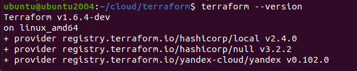

# Домашнее задание к занятию «Введение в Terraform»

## Задача 1

> Чек-лист готовности к домашнему заданию
* 1. Скачайте и установите Terraform версии =1.5.Х (версия 1.6 может вызывать проблемы с Яндекс провайдером) . Приложите скриншот вывода команды terraform --version


* 2. Скачайте на свой ПК этот git-репозиторий. Исходный код для выполнения задания расположен в директории 01/src.
```bash
ubuntu@ubuntu2004:~/git/git_terr_netology/ter-homeworks$ ls -Ra 01
01:
.  ..  hw-01.md  src

01/src:
.  ..  .gitignore  main.tf  .terraformrc
```    

 
  - **Replicated** сервисы в Docker Swarm, как следует из названия, создают реплики вашего приложения в масштабируемом режиме. 
Они работают по принципу создания нескольких инстансов вашего сервиса на разных нодах Swarm. 
Количество реплик задается пользователем и может быть изменено в любой момент
  - **Global** сервисы в Docker Swarm создают инстансы вашего приложения на всех доступных нодах. 
В этом случае количество реплик приложения не задается явно пользователем. Если появляется новая нода, Swarm автоматически создает реплику вашего приложения на ней.

>  Какой алгоритм выбора лидера используется в Docker Swarm-кластере?

 - разработан консенсус алгоритм **Raft**. Он обеспечивает механизм выбора лидера в кластере и синхронизацию состояния контейнеров. 
Raft в режиме swarm позволяет синхронизировать состояние контейнеров в разных сетях, обеспечивая стабильную работу приложений
Сам Raft-алгоритм имеет ограничение на количество управляющих нод. Распределенные решения
должны быть одобрены большинством управляющих узлов, называемых кворумом. Это означает, что рекомендуется нечетное количество управляющих узлов.

>  Что такое Overlay Network?

  - **overlay/overlay2** или Оверлей Наложенная сеть это сетевой драйвер для соединения несколько демонов Docker между собой 
и которые позволяют docker-swarm службам взаимодействовать друг с другом. 
Также можено использовать оверлейные сети для облегчения связи между docker-swarm и автономным контейнером 
или между двумя отдельными контейнерами на разных Docker демонах. 
Эта стратегия устраняет необходимость выполнения маршрутизации на уровне ОС между этими контейнерами

## Задача 2:
* Создайте ваш первый Docker Swarm-кластер в Яндекс Облаке.
>Чтобы получить зачёт, предоставьте скриншот из терминала (консоли) с выводом команды:
 
> ```
> docker node ls
> ```

</details>

      
 
## Задача 3:
* Создайте ваш первый, готовый к боевой эксплуатации кластер мониторинга, состоящий из стека микросервисов.
> Чтобы получить зачёт, предоставьте скриншот из терминала (консоли), с выводом команды:

  > ```
> docker service ls
> ```

</details>

```bash

[centos@node01 ~]$ sudo docker service ls
ID             NAME                                MODE         REPLICAS   IMAGE                                          PORTS
zyhnp7uq0jzg   swarm_monitoring_alertmanager       replicated   1/1        stefanprodan/swarmprom-alertmanager:v0.14.0    
4ao61u6luas6   swarm_monitoring_caddy              replicated   1/1        stefanprodan/caddy:latest                      *:3000->3000/tcp, *:9090->9090/tcp, *:9093-9094->9093-9094/tcp
jmfn60a9px6q   swarm_monitoring_cadvisor           global       6/6        google/cadvisor:latest                         
xpvxu06tdcig   swarm_monitoring_dockerd-exporter   global       6/6        stefanprodan/caddy:latest                      
o7w977pq40q5   swarm_monitoring_grafana            replicated   1/1        stefanprodan/swarmprom-grafana:5.3.4           
1pz42xezh3y5   swarm_monitoring_node-exporter      global       6/6        stefanprodan/swarmprom-node-exporter:v0.16.0   
jlry4dz7baxn   swarm_monitoring_prometheus         replicated   1/1        stefanprodan/swarmprom-prometheus:v2.5.0       
vgn0t5co5j5f   swarm_monitoring_unsee              replicated   1/1        cloudflare/unsee:v0.8.0        
 
```


