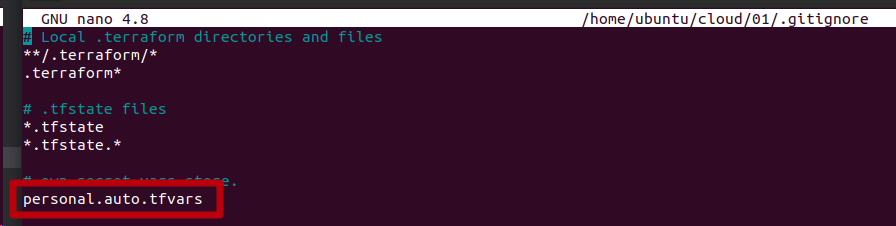
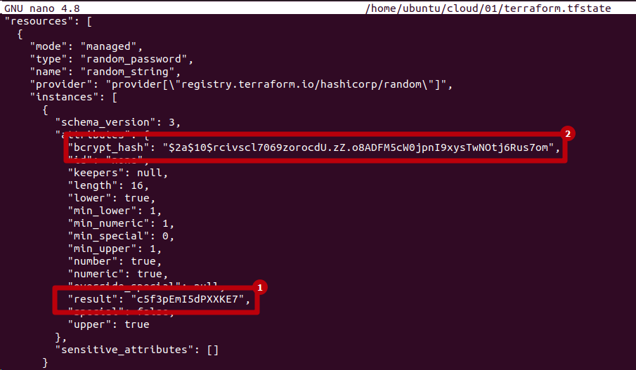

# Домашнее задание к занятию «Введение в Terraform»

## Чек-лист готовности к домашнему заданию
* 1. Скачайте и установите Terraform версии =1.5.Х (версия 1.6 может вызывать проблемы с Яндекс провайдером) . Приложите скриншот вывода команды terraform --version


* 2. Скачайте на свой ПК этот git-репозиторий. Исходный код для выполнения задания расположен в директории 01/src.

```bash
ubuntu@ubuntu2004:~/git/git_terr_netology/ter-homeworks$ ls -Ra 01
01:
.  ..  hw-01.md  src

01/src:
.  ..  .gitignore  main.tf  .terraformrc
```    

* 3.  Убедитесь, что в вашей ОС установлен docker.

```bash
ubuntu@ubuntu2004:~/cloud/terraform$ docker --version
Docker version 24.0.7, build afdd53b
```    

* 4. Зарегистрируйте аккаунт на сайте https://hub.docker.com/, выполните команду docker login и введите логин, пароль. 

```bash
ubuntu@ubuntu2004:~/cloud/terraform$ docker login
Authenticating with existing credentials...
WARNING! Your password will be stored unencrypted in /home/ubuntu/.docker/config.json.
Configure a credential helper to remove this warning. See
https://docs.docker.com/engine/reference/commandline/login/#credentials-store

Login Succeeded
```    

## Задание 1
* 1. Перейдите в каталог src. Скачайте все необходимые зависимости, использованные в проекте.

```bash
ubuntu@ubuntu2004:~/cloud/01$ ls -Ra
.:
.  ..  .gitignore  main.tf  .terraform  .terraform.lock.hcl  .terraformrc  terraform.tfstate

./.terraform:
.  ..  providers

./.terraform/providers:
.  ..  registry.terraform.io

./.terraform/providers/registry.terraform.io:
.  ..  hashicorp  kreuzwerker

./.terraform/providers/registry.terraform.io/hashicorp:
.  ..  random

./.terraform/providers/registry.terraform.io/hashicorp/random:
.  ..  3.5.1

./.terraform/providers/registry.terraform.io/hashicorp/random/3.5.1:
.  ..  linux_amd64

./.terraform/providers/registry.terraform.io/hashicorp/random/3.5.1/linux_amd64:
.  ..  terraform-provider-random_v3.5.1_x5

./.terraform/providers/registry.terraform.io/kreuzwerker:
.  ..  docker

./.terraform/providers/registry.terraform.io/kreuzwerker/docker:
.  ..  3.0.2

./.terraform/providers/registry.terraform.io/kreuzwerker/docker/3.0.2:
.  ..  linux_amd64

./.terraform/providers/registry.terraform.io/kreuzwerker/docker/3.0.2/linux_amd64:
.  ..  CHANGELOG.md  LICENSE  README.md  terraform-provider-docker_v3.0.2
```    

* 2. Изучите файл .gitignore. В каком terraform-файле, согласно этому .gitignore, допустимо сохранить личную, секретную информацию?


> в отмеченном файле допустимо сохранить личную, секретную информацию

* 3. Выполните код проекта. Найдите в state-файле секретное содержимое созданного ресурса random_password, пришлите в качестве ответа конкретный ключ и его значение.



    >1 значение
    >2 ключ

* 4. Раскомментируйте блок кода, примерно расположенный на строчках 29–42 файла main.tf. Выполните команду terraform validate. Объясните, в чём заключаются намеренно допущенные ошибки. Исправьте их.

* 5. Выполните код. В качестве ответа приложите: исправленный фрагмент кода и вывод команды docker ps.

* 6. Замените имя docker-контейнера в блоке кода на hello_world. Не перепутайте имя контейнера и имя образа. Мы всё ещё продолжаем использовать name = "nginx:latest". Выполните команду terraform apply -auto-approve. Объясните своими словами, в чём может быть опасность применения ключа -auto-approve. В качестве ответа дополнительно приложите вывод команды docker ps.

* 7. Уничтожьте созданные ресурсы с помощью terraform. Убедитесь, что все ресурсы удалены. Приложите содержимое файла terraform.tfstate.

* 8. Объясните, почему при этом не был удалён docker-образ nginx:latest. Ответ обязательно подкрепите строчкой из документации terraform провайдера docker. (ищите в классификаторе resource docker_image )


>  Какой алгоритм выбора лидера используется в Docker Swarm-кластере?

 - разработан консенсус алгоритм **Raft**. Он обеспечивает механизм выбора лидера в кластере и синхронизацию состояния контейнеров. 
Raft в режиме swarm позволяет синхронизировать состояние контейнеров в разных сетях, обеспечивая стабильную работу приложений
Сам Raft-алгоритм имеет ограничение на количество управляющих нод. Распределенные решения
должны быть одобрены большинством управляющих узлов, называемых кворумом. Это означает, что рекомендуется нечетное количество управляющих узлов.

>  Что такое Overlay Network?

  - **overlay/overlay2** или Оверлей Наложенная сеть это сетевой драйвер для соединения несколько демонов Docker между собой 
и которые позволяют docker-swarm службам взаимодействовать друг с другом. 
Также можено использовать оверлейные сети для облегчения связи между docker-swarm и автономным контейнером 
или между двумя отдельными контейнерами на разных Docker демонах. 
Эта стратегия устраняет необходимость выполнения маршрутизации на уровне ОС между этими контейнерами

## Задача 2:
* Создайте ваш первый Docker Swarm-кластер в Яндекс Облаке.
>Чтобы получить зачёт, предоставьте скриншот из терминала (консоли) с выводом команды:
 
> ```
> docker node ls
> ```

</details>

      
 
## Задача 3:
* Создайте ваш первый, готовый к боевой эксплуатации кластер мониторинга, состоящий из стека микросервисов.
> Чтобы получить зачёт, предоставьте скриншот из терминала (консоли), с выводом команды:

  > ```
> docker service ls
> ```

</details>

```bash

[centos@node01 ~]$ sudo docker service ls
ID             NAME                                MODE         REPLICAS   IMAGE                                          PORTS
zyhnp7uq0jzg   swarm_monitoring_alertmanager       replicated   1/1        stefanprodan/swarmprom-alertmanager:v0.14.0    
4ao61u6luas6   swarm_monitoring_caddy              replicated   1/1        stefanprodan/caddy:latest                      *:3000->3000/tcp, *:9090->9090/tcp, *:9093-9094->9093-9094/tcp
jmfn60a9px6q   swarm_monitoring_cadvisor           global       6/6        google/cadvisor:latest                         
xpvxu06tdcig   swarm_monitoring_dockerd-exporter   global       6/6        stefanprodan/caddy:latest                      
o7w977pq40q5   swarm_monitoring_grafana            replicated   1/1        stefanprodan/swarmprom-grafana:5.3.4           
1pz42xezh3y5   swarm_monitoring_node-exporter      global       6/6        stefanprodan/swarmprom-node-exporter:v0.16.0   
jlry4dz7baxn   swarm_monitoring_prometheus         replicated   1/1        stefanprodan/swarmprom-prometheus:v2.5.0       
vgn0t5co5j5f   swarm_monitoring_unsee              replicated   1/1        cloudflare/unsee:v0.8.0        
 
```


