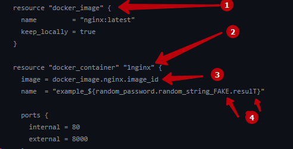

# Домашнее задание к занятию «Введение в Terraform»

## Чек-лист готовности к домашнему заданию
* 1. Скачайте и установите Terraform версии =1.5.Х (версия 1.6 может вызывать проблемы с Яндекс провайдером) . Приложите скриншот вывода команды terraform --version


* 2. Скачайте на свой ПК этот git-репозиторий. Исходный код для выполнения задания расположен в директории 01/src.

```bash
ubuntu@ubuntu2004:~/git/git_terr_netology/ter-homeworks$ ls -Ra 01
01:
.  ..  hw-01.md  src

01/src:
.  ..  .gitignore  main.tf  .terraformrc
```    

* 3.  Убедитесь, что в вашей ОС установлен docker.

```bash
ubuntu@ubuntu2004:~/cloud/terraform$ docker --version
Docker version 24.0.7, build afdd53b
```    

* 4. Зарегистрируйте аккаунт на сайте https://hub.docker.com/, выполните команду docker login и введите логин, пароль. 

```bash
ubuntu@ubuntu2004:~/cloud/terraform$ docker login
Authenticating with existing credentials...
WARNING! Your password will be stored unencrypted in /home/ubuntu/.docker/config.json.
Configure a credential helper to remove this warning. See
https://docs.docker.com/engine/reference/commandline/login/#credentials-store

Login Succeeded
```    

## Задание 1
* 1. Перейдите в каталог src. Скачайте все необходимые зависимости, использованные в проекте.

```bash
ubuntu@ubuntu2004:~/cloud/01$ ls -Ra
.:
.  ..  .gitignore  main.tf  .terraform  .terraform.lock.hcl  .terraformrc  terraform.tfstate

./.terraform:
.  ..  providers

./.terraform/providers:
.  ..  registry.terraform.io

./.terraform/providers/registry.terraform.io:
.  ..  hashicorp  kreuzwerker

./.terraform/providers/registry.terraform.io/hashicorp:
.  ..  random

./.terraform/providers/registry.terraform.io/hashicorp/random:
.  ..  3.5.1

./.terraform/providers/registry.terraform.io/hashicorp/random/3.5.1:
.  ..  linux_amd64

./.terraform/providers/registry.terraform.io/hashicorp/random/3.5.1/linux_amd64:
.  ..  terraform-provider-random_v3.5.1_x5

./.terraform/providers/registry.terraform.io/kreuzwerker:
.  ..  docker

./.terraform/providers/registry.terraform.io/kreuzwerker/docker:
.  ..  3.0.2

./.terraform/providers/regi[Terr_1.md](Terr_1.md)stry.terraform.io/kreuzwerker/docker/3.0.2:
.  ..  linux_amd64

./.terraform/providers/registry.terraform.io/kreuzwerker/docker/3.0.2/linux_amd64:
.  ..  CHANGELOG.md  LICENSE  README.md  terraform-provider-docker_v3.0.2
```    

* 2. Изучите файл .gitignore. В каком terraform-файле, согласно этому .gitignore, допустимо сохранить личную, секретную информацию?


> в отмеченном файле допустимо сохранить личную, секретную информацию

* 3. Выполните код проекта. Найдите в state-файле секретное содержимое созданного ресурса random_password, пришлите в качестве ответа конкретный ключ и его значение.


    >1 значение
    >2 ключ

* 4. Раскомментируйте блок кода, примерно расположенный на строчках 29–42 файла main.tf. Выполните команду terraform validate. 
Объясните, в чём заключаются намеренно допущенные ошибки. Исправьте их.



    в коде 4 ошибки:
    1. Отсутствует имя ресурса
    2. Неверное имя ресурса 
    3. Ссылка на незадекларированный ресурс
    4. Неверное имя.

* 5. Выполните код. В качестве ответа приложите: исправленный 
 

>фрагмент кода 

```bash
resource "docker_image" "latest" {
  name         = "nginx:latest"
  keep_locally = true
}

resource "docker_image" "nginx" {
  name = "nginx:stable-alpine"
}

 resource "docker_container" "nginx" {
  image = docker_image.nginx.image_id
  name  = "example_${random_password.random_string.result}"

  ports {
    internal = 80
    external = 8000
  }
```

> и вывод команды docker ps.

```bash
ubuntu@ubuntu2004:~/cloud/01$ docker ps
CONTAINER ID   IMAGE          COMMAND                  CREATED         STATUS         PORTS                  NAMES
fe329a111e2b   e6295d4bbc45   "/docker-entrypoint.…"   3 seconds ago   Up 2 seconds   0.0.0.0:8000->80/tcp   example_6P9JIAU5jb6TqKOB
```


* 6. Замените имя docker-контейнера в блоке кода на hello_world. 
Не перепутайте имя контейнера и имя образа. Мы всё ещё продолжаем использовать name = "nginx:latest". 
>Выполните команду terraform apply -auto-approve. 

```bash
ubuntu@ubuntu2004:~/cloud/01$ terraform apply -auto-approve
random_password.random_string: Refreshing state... [id=none]
docker_image.hello_world: Refreshing state... [id=sha256:e6295d4bbc4559ee7ed2e93830f4228a08af4114d7914db140a026f84e69adbbnginx:stable-alpine]
docker_image.latest: Refreshing state... [id=sha256:a6bd71f48f6839d9faae1f29d3babef831e76bc213107682c5cc80f0cbb30866nginx:latest]
docker_container.nginx: Refreshing state... [id=afedafdc2477b6f611fbb63a7ca2d26f50324485cc30663ea89b7084a729d335]

No changes. Your infrastructure matches the configuration.

Terraform has compared your real infrastructure against your configuration and found no differences, so no changes are needed.
```

> Объясните своими словами, в чём может быть опасность применения ключа -auto-approve. 

- Команда выполняет и применяет изменения к вашей инфраструктуре, не запрашивая одобрения у пользователя 
Поэтому ошибки могут привести к необратимой потере данных или уничтожению информации.

>В качестве ответа дополнительно приложите вывод команды docker ps.
```bash
ubuntu@ubuntu2004:~/cloud/01$ docker ps
CONTAINER ID   IMAGE          COMMAND                  CREATED          STATUS          PORTS                  NAMES
afedafdc2477   e6295d4bbc45   "/docker-entrypoint.…"   52 seconds ago   Up 51 seconds   0.0.0.0:8000->80/tcp   example_6P9JIAU5jb6TqKOB
```

* 7. Уничтожьте созданные ресурсы с помощью terraform. Убедитесь, что все ресурсы удалены. Приложите содержимое файла terraform.tfstate.
```bash
ubuntu@ubuntu2004:~/cloud/01$ cat terraform.tfstate
{
  "version": 4,
  "terraform_version": "1.6.4",
  "serial": 48,
  "lineage": "f94eab55-3c8f-f95f-9760-624360236297",
  "outputs": {},
  "resources": [],
  "check_results": null
}
```

* 8. Объясните, почему при этом не был удалён docker-образ nginx:latest. 
Ответ обязательно подкрепите строчкой из документации terraform провайдера docker. (ищите в классификаторе resource docker_image )


