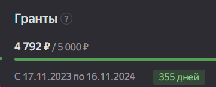
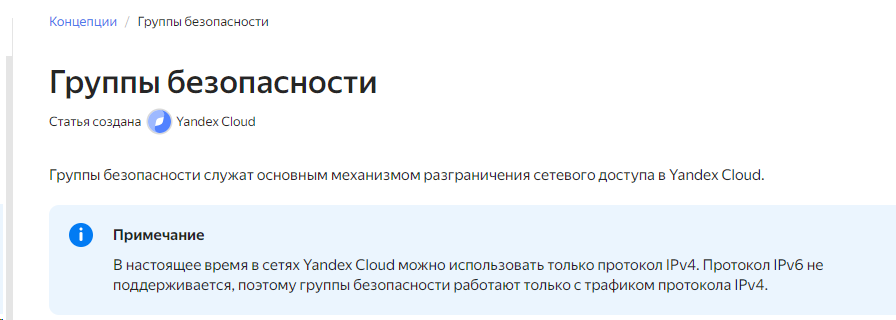
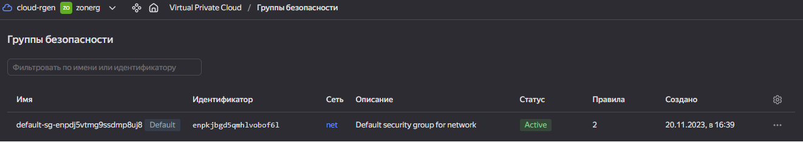
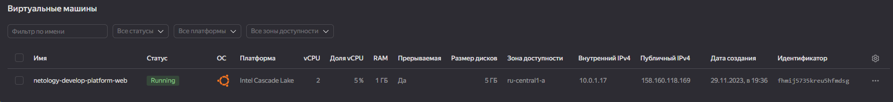
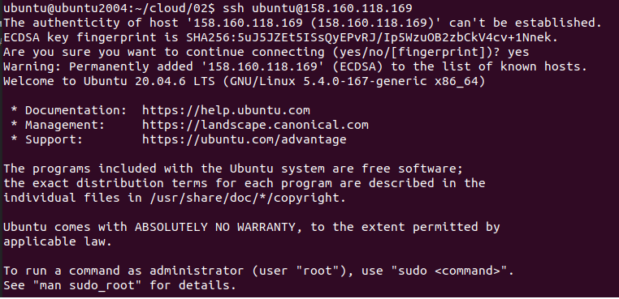

# Домашнее задание к занятию «Введение в Terraform»

## Чек-лист готовности к домашнему заданию
* 1. Зарегистрирован аккаунт в Yandex Cloud. Использован промокод на грант.



* 2. Установлен инструмент Yandex CLI.

```bash
ubuntu@ubuntu2004:~$ yc --version
Yandex Cloud CLI 0.113.0 linux/amd64
```    

* 3.  Исходный код для выполнения задания расположен в директории 02/src.

```bash
ubuntu@ubuntu2004:~/git/git_terr_netology/ter-homeworks$ ls -Ra 02
02:
.  ..  demostration1.tf  demostration2.tf  hw-02.md  src

02/src:
.   console.tf  locals.tf  outputs.tf                    providers.tf  variables.tf
..  .gitignore  main.tf    personal.auto.tfvars_example  terraformrc
```    


## Задание 0
* 1. Ознакомьтесь с документацией к security-groups в Yandex Cloud.




* 2. Запросите preview-доступ к этому функционалу в личном кабинете Yandex Cloud. Обычно его выдают в течение 24-х часов. https://console.cloud.yandex.ru/folders/<ваш cloud_id>/vpc/security-groups.
Этот функционал понадобится к следующей лекции/



## Задание 1
В качестве решения приложите:

* 1. скриншот ЛК Yandex Cloud с созданной ВМ;



* 2. скриншот успешного подключения к консоли ВМ через ssh. 
К OS ubuntu "out of a box, те из коробки" необходимо подключаться под пользователем ubuntu: "ssh ubuntu@vm_ip_address"; 




* 3. ответы на вопросы
как в процессе обучения могут пригодиться параметры:
preemptible = true и core_fraction=5 в параметрах ВМ. Ответ в документации Yandex Cloud
> при обучении эти параметра иммет смысл ставить минимальными так как уменьшают стоимость
    
## Задание 2
* 1.  Изучите файлы проекта.

* 2. Замените все хардкод-значения для ресурсов yandex_compute_image и yandex_compute_instance на отдельные переменные. К названиям переменных ВМ добавьте в начало префикс vm_web_ . Пример: vm_web_name.

* 3. Объявите нужные переменные в файле variables.tf, обязательно указывайте тип переменной. Заполните их default прежними значениями из main.tf.

* 4. Проверьте terraform plan. Изменений быть не должно


## Задание 3
* 1. Создайте в корне проекта файл 'vms_platform.tf' . Перенесите в него все переменные первой ВМ.

* 2. Скопируйте блок ресурса и создайте с его помощью вторую ВМ в файле main.tf: "netology-develop-platform-db" , cores = 2, memory = 2, core_fraction = 20. Объявите её переменные с префиксом vm_db_ в том же файле ('vms_platform.tf').

* 3. Примените изменения.


## Задание 4
* 1. Объявите в файле outputs.tf output типа map, содержащий { instance_name = external_ip } для каждой из ВМ.

* 2. Примените изменения.
>В качестве решения приложите вывод значений ip-адресов команды terraform output.


## Задание 5
* 1. В файле locals.tf опишите в одном local-блоке имя каждой ВМ, используйте интерполяцию ${..} с несколькими переменными по примеру из лекции.

* 2. Замените переменные с именами ВМ из файла variables.tf на созданные вами local-переменные.

* 3. Примените изменения.


## Задание 6
* 1. Вместо использования трёх переменных ".._cores",".._memory",".._core_fraction" в блоке resources {...}, объедините их в переменные типа map с именами "vm_web_resources" и "vm_db_resources". В качестве продвинутой практики попробуйте создать одну map-переменную vms_resources и уже внутри неё конфиги обеих ВМ — вложенный map.

* 2. Также поступите с блоком metadata {serial-port-enable, ssh-keys}, эта переменная должна быть общая для всех ваших ВМ.

* 3. Найдите и удалите все более не используемые переменные проекта.

* 4. Проверьте terraform plan. Изменений быть не должно.

>фрагмент кода 

```bash

```

