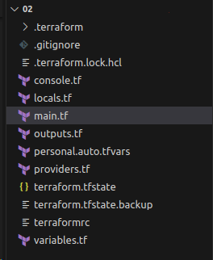
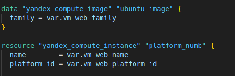
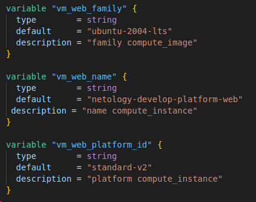

# Домашнее задание к занятию «Введение в Terraform»

## Чек-лист готовности к домашнему заданию
* 1. Зарегистрирован аккаунт в Yandex Cloud. Использован промокод на грант.


* 2. Установлен инструмент Yandex CLI.

```bash
ubuntu@ubuntu2004:~$ yc --version
Yandex Cloud CLI 0.113.0 linux/amd64
```    

* 3.  Исходный код для выполнения задания расположен в директории 02/src.

```bash
ubuntu@ubuntu2004:~/git/git_terr_netology/ter-homeworks$ ls -Ra 02
02:
.  ..  demostration1.tf  demostration2.tf  hw-02.md  src

02/src:
.   console.tf  locals.tf  outputs.tf                    providers.tf  variables.tf
..  .gitignore  main.tf    personal.auto.tfvars_example  terraformrc
```    


## Задание 0
* 1. Ознакомьтесь с документацией к security-groups в Yandex Cloud.


* 2. Запросите preview-доступ к этому функционалу в личном кабинете Yandex Cloud. Обычно его выдают в течение 24-х часов. https://console.cloud.yandex.ru/folders/<ваш cloud_id>/vpc/security-groups.
Этот функционал понадобится к следующей лекции/


## Задание 1
В качестве решения приложите:

* 1. скриншот ЛК Yandex Cloud с созданной ВМ;


* 2. скриншот успешного подключения к консоли ВМ через ssh. 
К OS ubuntu "out of a box, те из коробки" необходимо подключаться под пользователем ubuntu: "ssh ubuntu@vm_ip_address"; 


* 3. ответы на вопросы
как в процессе обучения могут пригодиться параметры:
preemptible = true и core_fraction=5 в параметрах ВМ. Ответ в документации Yandex Cloud
> при обучении эти параметра иммет смысл ставить минимальными так как уменьшают стоимость
    
## Задание 2
* 1.  Изучите файлы проекта.



* 2. Замените все хардкод-значения для ресурсов yandex_compute_image и yandex_compute_instance на отдельные переменные. 
К названиям переменных ВМ добавьте в начало префикс vm_web_ . Пример: vm_web_name.



* 3. Объявите нужные переменные в файле variables.tf, обязательно указывайте тип переменной. 
Заполните их default прежними значениями из main.tf.



* 4. Проверьте terraform plan. Изменений быть не должно


<details>
<summary>вывод команды  terraform plan</summary>

```bash
ubuntu@ubuntu2004:~/cloud/02$
data.yandex_compute_image.ubuntu_image: Reading...
data.yandex_compute_image.ubuntu_image: Read complete after 0s [id=fd8b6qcrqbaqtnuumbph]

Terraform used the selected providers to generate the following execution plan. Resource actions are indicated with the following symbols:
  + create

Terraform will perform the following actions:

  # yandex_compute_instance.platform_numb will be created
  + resource "yandex_compute_instance" "platform_numb" {
      + created_at                = (known after apply)
      + folder_id                 = (known after apply)
      + fqdn                      = (known after apply)
      + gpu_cluster_id            = (known after apply)
      + hostname                  = (known after apply)
      + id                        = (known after apply)
      + metadata                  = {
          + "serial-port-enable" = "1"
          + "ssh-keys"           = "ubuntu_image:ssh-ed25519 AAAAC3NzaC1lZDI1NTE5AAAAIDz5P+8JFO+J20Vy4JzoHoHz1tL11ovV/5Ach28RrouA ubuntu@ubuntu2004"
        }
      + name                      = "netology-develop-platform-web"
      + network_acceleration_type = "standard"
      + platform_id               = "standard-v2"
      + service_account_id        = (known after apply)
      + status                    = (known after apply)
      + zone                      = (known after apply)

      + boot_disk {
          + auto_delete = true
          + device_name = (known after apply)
          + disk_id     = (known after apply)
          + mode        = (known after apply)

          + initialize_params {
              + block_size  = (known after apply)
              + description = (known after apply)
              + image_id    = "fd8b6qcrqbaqtnuumbph"
              + name        = (known after apply)
              + size        = (known after apply)
              + snapshot_id = (known after apply)
              + type        = "network-hdd"
            }
        }

      + network_interface {
          + index              = (known after apply)
          + ip_address         = (known after apply)
          + ipv4               = true
          + ipv6               = (known after apply)
          + ipv6_address       = (known after apply)
          + mac_address        = (known after apply)
          + nat                = true
          + nat_ip_address     = (known after apply)
          + nat_ip_version     = (known after apply)
          + security_group_ids = (known after apply)
          + subnet_id          = (known after apply)
        }

      + resources {
          + core_fraction = 5
          + cores         = 2
          + memory        = 1
        }

      + scheduling_policy {
          + preemptible = true
        }
    }

  # yandex_vpc_network.develop will be created
  + resource "yandex_vpc_network" "develop" {
      + created_at                = (known after apply)
      + default_security_group_id = (known after apply)
      + folder_id                 = (known after apply)
      + id                        = (known after apply)
      + labels                    = (known after apply)
      + name                      = "develop"
      + subnet_ids                = (known after apply)
    }

  # yandex_vpc_subnet.subnet_develop will be created
  + resource "yandex_vpc_subnet" "subnet_develop" {
      + created_at     = (known after apply)
      + folder_id      = (known after apply)
      + id             = (known after apply)
      + labels         = (known after apply)
      + name           = "develop"
      + network_id     = (known after apply)
      + v4_cidr_blocks = [
          + "10.0.1.0/24",
        ]
      + v6_cidr_blocks = (known after apply)
      + zone           = "ru-central1-a"
    }

Plan: 3 to add, 0 to change, 0 to destroy.

Note: You didn't use the -out option to save this plan, so Terraform can't guarantee to take exactly these actions if you run "terraform apply" now.
```

</details>


## Задание 3
* 1. Создайте в корне проекта файл 'vms_platform.tf' . Перенесите в него все переменные первой ВМ.

* 2. Скопируйте блок ресурса и создайте с его помощью вторую ВМ в файле main.tf: "netology-develop-platform-db" , cores = 2, memory = 2, core_fraction = 20. Объявите её переменные с префиксом vm_db_ в том же файле ('vms_platform.tf').

* 3. Примените изменения.


## Задание 4
* 1. Объявите в файле outputs.tf output типа map, содержащий { instance_name = external_ip } для каждой из ВМ.

* 2. Примените изменения.
>В качестве решения приложите вывод значений ip-адресов команды terraform output.


## Задание 5
* 1. В файле locals.tf опишите в одном local-блоке имя каждой ВМ, используйте интерполяцию ${..} с несколькими переменными по примеру из лекции.

* 2. Замените переменные с именами ВМ из файла variables.tf на созданные вами local-переменные.

* 3. Примените изменения.


## Задание 6
* 1. Вместо использования трёх переменных ".._cores",".._memory",".._core_fraction" в блоке resources {...}, объедините их в переменные типа map с именами "vm_web_resources" и "vm_db_resources". В качестве продвинутой практики попробуйте создать одну map-переменную vms_resources и уже внутри неё конфиги обеих ВМ — вложенный map.

* 2. Также поступите с блоком metadata {serial-port-enable, ssh-keys}, эта переменная должна быть общая для всех ваших ВМ.

* 3. Найдите и удалите все более не используемые переменные проекта.

* 4. Проверьте terraform plan. Изменений быть не должно.

>фрагмент кода 

```bash

```

