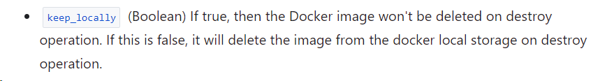

# Домашнее задание к занятию «Введение в Terraform»

## Чек-лист готовности к домашнему заданию
* 1. Зарегистрирован аккаунт в Yandex Cloud. Использован промокод на грант.


* 2. Установлен инструмент Yandex CLI.

```bash
ubuntu@ubuntu2004:~$ yc --version
Yandex Cloud CLI 0.113.0 linux/amd64
```    

* 3.  Исходный код для выполнения задания расположен в директории 02/src.

```bash
ubuntu@ubuntu2004:~/git/git_terr_netology/ter-homeworks$ ls -Ra 02
02:
.  ..  demostration1.tf  demostration2.tf  hw-02.md  src

02/src:
.   console.tf  locals.tf  outputs.tf                    providers.tf  variables.tf
..  .gitignore  main.tf    personal.auto.tfvars_example  terraformrc
```    


## Задание 0
* 1. Ознакомьтесь с документацией к security-groups в Yandex Cloud.


* 2. Запросите preview-доступ к этому функционалу в личном кабинете Yandex Cloud. Обычно его выдают в течение 24-х часов. https://console.cloud.yandex.ru/folders/<ваш cloud_id>/vpc/security-groups.
Этот функционал понадобится к следующей лекции/


> в отмеченном файле допустимо сохранить личную, секретную информацию


## Задание 1
* 1. Изучите проект. В файле variables.tf объявлены переменные для Yandex provider.

   >1 значение
   >2 ключ

* 2. Переименуйте файл personal.auto.tfvars_example в personal.auto.tfvars. Заполните переменные: идентификаторы облака, токен доступа. Благодаря .gitignore этот файл не попадёт в публичный репозиторий. Вы можете выбрать иной способ безопасно передать секретные данные в terraform..


    в коде 4 ошибки:
   1. Отсутствует имя ресурса
   2. Неверное имя ресурса 
   3. Ссылка на незадекларированный ресурс
   4. Неверное имя.

* 3.  Сгенерируйте или используйте свой текущий ssh-ключ. Запишите его открытую часть в переменную vms_ssh_root_key
 

>фрагмент кода 

```bash

```

> и вывод команды docker ps.

```bash
ubuntu@ubuntu2004:~/cloud/01$ docker ps
CONTAINER ID   IMAGE          COMMAND                  CREATED         STATUS         PORTS                  NAMES
fe329a111e2b   e6295d4bbc45   "/docker-entrypoint.…"   3 seconds ago   Up 2 seconds   0.0.0.0:8000->80/tcp   example_6P9JIAU5jb6TqKOB
```


* 6. Замените имя docker-контейнера в блоке кода на hello_world. 
Не перепутайте имя контейнера и имя образа. Мы всё ещё продолжаем использовать name = "nginx:latest". 
>Выполните команду terraform apply -auto-approve. 

```bash
ubuntu@ubuntu2004:~/cloud/01$ terraform apply -auto-approve
random_password.random_string: Refreshing state... [id=none]
docker_image.hello_world: Refreshing state... [id=sha256:e6295d4bbc4559ee7ed2e93830f4228a08af4114d7914db140a026f84e69adbbnginx:stable-alpine]
docker_image.latest: Refreshing state... [id=sha256:a6bd71f48f6839d9faae1f29d3babef831e76bc213107682c5cc80f0cbb30866nginx:latest]
docker_container.nginx: Refreshing state... [id=afedafdc2477b6f611fbb63a7ca2d26f50324485cc30663ea89b7084a729d335]

No changes. Your infrastructure matches the configuration.

Terraform has compared your real infrastructure against your configuration and found no differences, so no changes are needed.
```

> Объясните своими словами, в чём может быть опасность применения ключа -auto-approve. 

- Команда выполняет и применяет изменения к вашей инфраструктуре, не запрашивая одобрения у пользователя 
Поэтому ошибки могут привести к необратимой потере данных или уничтожению информации.

>В качестве ответа дополнительно приложите вывод команды docker ps.
```bash
ubuntu@ubuntu2004:~/cloud/01$ docker ps
CONTAINER ID   IMAGE          COMMAND                  CREATED          STATUS          PORTS                  NAMES
afedafdc2477   e6295d4bbc45   "/docker-entrypoint.…"   52 seconds ago   Up 51 seconds   0.0.0.0:8000->80/tcp   example_6P9JIAU5jb6TqKOB
```

* 7. Уничтожьте созданные ресурсы с помощью terraform. Убедитесь, что все ресурсы удалены. Приложите содержимое файла terraform.tfstate.
```bash
ubuntu@ubuntu2004:~/cloud/01$ cat terraform.tfstate
{
  "version": 4,
  "terraform_version": "1.6.4",
  "serial": 48,
  "lineage": "f94eab55-3c8f-f95f-9760-624360236297",
  "outputs": {},
  "resources": [],
  "check_results": null
}
```

* 8. Объясните, почему при этом не был удалён docker-образ nginx:latest. 
Ответ обязательно подкрепите строчкой из документации terraform провайдера docker. (ищите в классификаторе resource docker_image )




...
