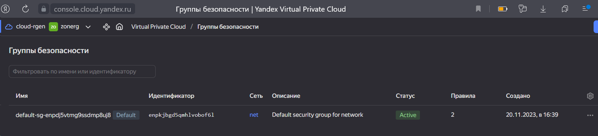

# Домашнее задание к занятию «Управляющие конструкции в коде Terraform»

## Чек-лист готовности к домашнему заданию
* 1. Зарегистрирован аккаунт в Yandex Cloud. Использован промокод на грант.
[Урок02](https://github.com/R-Gennadi/devops-netology/blob/main/Terra/Terr_2.md "Ранее было представлено")

* 2. Установлен инструмент Yandex CLI.
[Урок02](https://github.com/R-Gennadi/devops-netology/blob/main/Terra/Terr_2.md "Ранее было представлено")

* 3.  Доступен исходный код для выполнения задания в директории 03/src

```bash
ubuntu@ubuntu2004:~/cloud$ ls -Ra 03
03:
.  ..  03

03/03:
.  ..  demonstration2  demostration1.tf  hw-03.md  src

03/03/demonstration2:
.  ..  .gitignore  hosts.tftpl  main.tf  personal.auto.tfvars_example  test.yml  variables.tf

03/03/src:
.  ..  .gitignore  main.tf  providers.tf  security.tf  terraformrc  variables.tf
```    
* 4.  Любые ВМ, использованные при выполнении задания, должны быть прерываемыми, для экономии средств.
> принято


## Задание 1
* 1. Изучите проект.
* 2. Заполните файл personal.auto.tfvars.
* 3. Инициализируйте проект, выполните код. Он выполнится, даже если доступа к preview нет 



## Задание 2

* 1. Создайте файл count-vm.tf. 
Опишите в нём создание двух одинаковых ВМ web-1 и web-2 (не web-0 и web-1) с минимальными параметрами, используя мета-аргумент count loop.
Назначьте ВМ созданную в первом задании группу безопасности.(как это сделать узнайте в документации провайдера yandex/compute_instance )

* 2.  Создайте файл for_each-vm.tf. 
Опишите в нём создание двух ВМ для баз данных с именами "main" и "replica" разных по cpu/ram/disk , используя мета-аргумент for_each loop.
Используйте для обеих ВМ одну общую переменную типа:

variable "each_vm" {
  type = list(object({  vm_name=string, cpu=number, ram=number, disk=number }))
}

* 4.  ВМ из пункта 2.1 должны создаваться после создания ВМ из пункта 2.2.

* 5. Используйте функцию file в local-переменной для считывания ключа ~/.ssh/id_rsa.pub и его последующего использования в блоке metadata, взятому из ДЗ 2.

<details>
<summary> files for код </summary>

</details>

[count-vm.tf](Files_3%2Fcount-vm.tf)
[for_each-vm.tf](Files_3%2Ffor_each-vm.tf)

* 6. Инициализируйте проект, выполните код.

<details>
<summary> код </summary>


</details>

## Задание 3


## Задание 4


## Задание 4