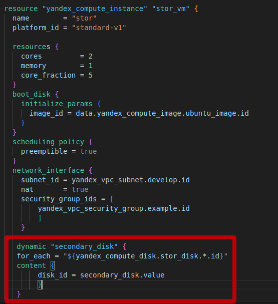

# Домашнее задание к занятию «Управляющие конструкции в коде Terraform»

## Чек-лист готовности к домашнему заданию
* 1. Зарегистрирован аккаунт в Yandex Cloud. Использован промокод на грант.
[Урок02](https://github.com/R-Gennadi/devops-netology/blob/main/Terra/Terr_2.md "Ранее было представлено")

* 2. Установлен инструмент Yandex CLI.
[Урок02](https://github.com/R-Gennadi/devops-netology/blob/main/Terra/Terr_2.md "Ранее было представлено")

* 3.  Доступен исходный код для выполнения задания в директории 03/src

```bash
ubuntu@ubuntu2004:~/cloud$ ls -Ra 03
03:
.  ..  03

03/03:
.  ..  demonstration2  demostration1.tf  hw-03.md  src

03/03/demonstration2:
.  ..  .gitignore  hosts.tftpl  main.tf  personal.auto.tfvars_example  test.yml  variables.tf

03/03/src:
.  ..  .gitignore  main.tf  providers.tf  security.tf  terraformrc  variables.tf
```    
* 4.  Любые ВМ, использованные при выполнении задания, должны быть прерываемыми, для экономии средств.
> принято


## Задание 1
* 1. Изучите проект.
* 2. Заполните файл personal.auto.tfvars.
* 3. Инициализируйте проект, выполните код. Он выполнится, даже если доступа к preview нет 


## Задание 2

* 1. Создайте файл count-vm.tf. 
Опишите в нём создание двух одинаковых ВМ web-1 и web-2 (не web-0 и web-1) с минимальными параметрами, используя мета-аргумент count loop.
Назначьте ВМ созданную в первом задании группу безопасности.(как это сделать узнайте в документации провайдера yandex/compute_instance )


* 2.  Создайте файл for_each-vm.tf. 
Опишите в нём создание двух ВМ для баз данных с именами "main" и "replica" разных по cpu/ram/disk , используя мета-аргумент for_each loop.


Используйте для обеих ВМ одну общую переменную типа:
 variable "each_vm" {
 type = list(object({  vm_name=string, cpu=number, ram=number, disk=number }))
-}


* 4. ВМ из пункта 2.1 должны создаваться после создания ВМ из пункта 2.2.


* 5. Используйте функцию file в local-переменной для считывания ключа ~/.ssh/id_rsa.pub и его последующего использования в блоке metadata, взятому из ДЗ 2.

 

> files for код:

[count-vm.tf](Files_3%2Fcount-vm.tf)

[for_each-vm.tf](Files_3%2Ffor_each-vm.tf)

[locals.tf](Files_3%2Flocals.tf)

[variables.tf](Files_3%2Fvariables.tf)

* 6. Инициализируйте проект, выполните код.
Скриншот результата выполнения кода
 

<details>
<summary> вывод команды  terraform apply </summary>
ubuntu@ubuntu2004:~/cloud/test$ terraform apply
data.yandex_compute_image.ubuntu_image: Reading...
data.yandex_compute_image.ubuntu_image: Read complete after 1s [id=fd839i1233e8krfrf92s]

Terraform used the selected providers to generate the following execution plan. Resource actions are indicated with the following symbols:
  + create

Terraform will perform the following actions:

  # yandex_compute_instance.for_each["main"] will be created
  + resource "yandex_compute_instance" "for_each" {
      + created_at                = (known after apply)
      + folder_id                 = (known after apply)
      + fqdn                      = (known after apply)
      + gpu_cluster_id            = (known after apply)
      + hostname                  = (known after apply)
      + id                        = (known after apply)
      + metadata                  = {
          + "ssh-keys" = <<-EOT
                ubuntu:ssh-rsa AAAAB3NzaC1yc2EAAAADAQABAAABgQDJMeF68bjUnd9dmkuwV3yB7iIIBQddxXzwbMkAMEk8feFJAdSCLvUBr7n4tpmfNFbCVeXmLkSUzPx8mmVOhnkQWlPlYbAsMNB9sa1W4ME39OxXZ+GrCMt2ew3CdwtQhZESXLeSbKZx0GD6N0kSdBA/42FzZmbjX9rbagzFm2ywWAv8pKQXcuFLT5QYzsew9+Du46C8NZowJPCFyzgezhigdfCdwpGuQsOn3eFvvrMDrRTOKO1ifk11ZNeWWLBGgFGFXUcU4MseMYzwUmXsI5PQ5Bk2UZhUzctSHRHsysADh+T8NiAXVAvi2RhuGen3SaXble+iRdfD2NIWi4vL7AnFV7FxGY4BsP+2XOu82jgmpPKRhAGSub7LNTJOkQWo9zJlP+yWgvi3Y66OUOxpjS7t12EvyUPjb/nstCDeJWzu3/9XgIKpU3eW1Hm7SZF75rDUmirjwQ5rNAi58iBpldP/Mq4v595NpeQRqVhZiWrP3Kl3N7Hq2bjMANJ2spZzB1k= ubuntu@ubuntu2004
            EOT
        }
      + name                      = "main"
      + network_acceleration_type = "standard"
      + platform_id               = "standard-v1"
      + service_account_id        = (known after apply)
      + status                    = (known after apply)
      + zone                      = (known after apply)

      + boot_disk {
          + auto_delete = true
          + device_name = (known after apply)
          + disk_id     = (known after apply)
          + mode        = (known after apply)

          + initialize_params {
              + block_size  = (known after apply)
              + description = (known after apply)
              + image_id    = "fd8g64rcu9fq5kpfqls0"
              + name        = (known after apply)
              + size        = (known after apply)
              + snapshot_id = (known after apply)
              + type        = "network-hdd"
            }
        }

      + network_interface {
          + index              = (known after apply)
          + ip_address         = (known after apply)
          + ipv4               = true
          + ipv6               = (known after apply)
          + ipv6_address       = (known after apply)
          + mac_address        = (known after apply)
          + nat                = true
          + nat_ip_address     = (known after apply)
          + nat_ip_version     = (known after apply)
          + security_group_ids = (known after apply)
          + subnet_id          = (known after apply)
        }

      + resources {
          + core_fraction = 20
          + cores         = 4
          + memory        = 4
        }
    }

  # yandex_compute_instance.for_each["replica"] will be created
  + resource "yandex_compute_instance" "for_each" {
      + created_at                = (known after apply)
      + folder_id                 = (known after apply)
      + fqdn                      = (known after apply)
      + gpu_cluster_id            = (known after apply)
      + hostname                  = (known after apply)
      + id                        = (known after apply)
      + metadata                  = {
          + "ssh-keys" = <<-EOT
                ubuntu:ssh-rsa AAAAB3NzaC1yc2EAAAADAQABAAABgQDJMeF68bjUnd9dmkuwV3yB7iIIBQddxXzwbMkAMEk8feFJAdSCLvUBr7n4tpmfNFbCVeXmLkSUzPx8mmVOhnkQWlPlYbAsMNB9sa1W4ME39OxXZ+GrCMt2ew3CdwtQhZESXLeSbKZx0GD6N0kSdBA/42FzZmbjX9rbagzFm2ywWAv8pKQXcuFLT5QYzsew9+Du46C8NZowJPCFyzgezhigdfCdwpGuQsOn3eFvvrMDrRTOKO1ifk11ZNeWWLBGgFGFXUcU4MseMYzwUmXsI5PQ5Bk2UZhUzctSHRHsysADh+T8NiAXVAvi2RhuGen3SaXble+iRdfD2NIWi4vL7AnFV7FxGY4BsP+2XOu82jgmpPKRhAGSub7LNTJOkQWo9zJlP+yWgvi3Y66OUOxpjS7t12EvyUPjb/nstCDeJWzu3/9XgIKpU3eW1Hm7SZF75rDUmirjwQ5rNAi58iBpldP/Mq4v595NpeQRqVhZiWrP3Kl3N7Hq2bjMANJ2spZzB1k= ubuntu@ubuntu2004
            EOT
        }
      + name                      = "replica"
      + network_acceleration_type = "standard"
      + platform_id               = "standard-v1"
      + service_account_id        = (known after apply)
      + status                    = (known after apply)
      + zone                      = (known after apply)

      + boot_disk {
          + auto_delete = true
          + device_name = (known after apply)
          + disk_id     = (known after apply)
          + mode        = (known after apply)

          + initialize_params {
              + block_size  = (known after apply)
              + description = (known after apply)
              + image_id    = "fd8g64rcu9fq5kpfqls0"
              + name        = (known after apply)
              + size        = (known after apply)
              + snapshot_id = (known after apply)
              + type        = "network-hdd"
            }
        }

      + network_interface {
          + index              = (known after apply)
          + ip_address         = (known after apply)
          + ipv4               = true
          + ipv6               = (known after apply)
          + ipv6_address       = (known after apply)
          + mac_address        = (known after apply)
          + nat                = true
          + nat_ip_address     = (known after apply)
          + nat_ip_version     = (known after apply)
          + security_group_ids = (known after apply)
          + subnet_id          = (known after apply)
        }

      + resources {
          + core_fraction = 100
          + cores         = 2
          + memory        = 2
        }
    }

  # yandex_compute_instance.secu[0] will be created
  + resource "yandex_compute_instance" "secu" {
      + created_at                = (known after apply)
      + folder_id                 = (known after apply)
      + fqdn                      = (known after apply)
      + gpu_cluster_id            = (known after apply)
      + hostname                  = (known after apply)
      + id                        = (known after apply)
      + metadata                  = {
          + "ssh-keys" = <<-EOT
                ubuntu:ssh-rsa AAAAB3NzaC1yc2EAAAADAQABAAABgQDJMeF68bjUnd9dmkuwV3yB7iIIBQddxXzwbMkAMEk8feFJAdSCLvUBr7n4tpmfNFbCVeXmLkSUzPx8mmVOhnkQWlPlYbAsMNB9sa1W4ME39OxXZ+GrCMt2ew3CdwtQhZESXLeSbKZx0GD6N0kSdBA/42FzZmbjX9rbagzFm2ywWAv8pKQXcuFLT5QYzsew9+Du46C8NZowJPCFyzgezhigdfCdwpGuQsOn3eFvvrMDrRTOKO1ifk11ZNeWWLBGgFGFXUcU4MseMYzwUmXsI5PQ5Bk2UZhUzctSHRHsysADh+T8NiAXVAvi2RhuGen3SaXble+iRdfD2NIWi4vL7AnFV7FxGY4BsP+2XOu82jgmpPKRhAGSub7LNTJOkQWo9zJlP+yWgvi3Y66OUOxpjS7t12EvyUPjb/nstCDeJWzu3/9XgIKpU3eW1Hm7SZF75rDUmirjwQ5rNAi58iBpldP/Mq4v595NpeQRqVhZiWrP3Kl3N7Hq2bjMANJ2spZzB1k= ubuntu@ubuntu2004
            EOT
        }
      + name                      = "web-1"
      + network_acceleration_type = "standard"
      + platform_id               = "standard-v2"
      + service_account_id        = (known after apply)
      + status                    = (known after apply)
      + zone                      = (known after apply)

      + boot_disk {
          + auto_delete = true
          + device_name = (known after apply)
          + disk_id     = (known after apply)
          + mode        = (known after apply)

          + initialize_params {
              + block_size  = (known after apply)
              + description = (known after apply)
              + image_id    = "fd839i1233e8krfrf92s"
              + name        = (known after apply)
              + size        = (known after apply)
              + snapshot_id = (known after apply)
              + type        = "network-hdd"
            }
        }

      + network_interface {
          + index              = (known after apply)
          + ip_address         = (known after apply)
          + ipv4               = true
          + ipv6               = (known after apply)
          + ipv6_address       = (known after apply)
          + mac_address        = (known after apply)
          + nat                = true
          + nat_ip_address     = (known after apply)
          + nat_ip_version     = (known after apply)
          + security_group_ids = (known after apply)
          + subnet_id          = (known after apply)
        }

      + resources {
          + core_fraction = 5
          + cores         = 2
          + memory        = 1
        }

      + scheduling_policy {
          + preemptible = true
        }
    }

  # yandex_compute_instance.secu[1] will be created
  + resource "yandex_compute_instance" "secu" {
      + created_at                = (known after apply)
      + folder_id                 = (known after apply)
      + fqdn                      = (known after apply)
      + gpu_cluster_id            = (known after apply)
      + hostname                  = (known after apply)
      + id                        = (known after apply)
      + metadata                  = {
          + "ssh-keys" = <<-EOT
                ubuntu:ssh-rsa AAAAB3NzaC1yc2EAAAADAQABAAABgQDJMeF68bjUnd9dmkuwV3yB7iIIBQddxXzwbMkAMEk8feFJAdSCLvUBr7n4tpmfNFbCVeXmLkSUzPx8mmVOhnkQWlPlYbAsMNB9sa1W4ME39OxXZ+GrCMt2ew3CdwtQhZESXLeSbKZx0GD6N0kSdBA/42FzZmbjX9rbagzFm2ywWAv8pKQXcuFLT5QYzsew9+Du46C8NZowJPCFyzgezhigdfCdwpGuQsOn3eFvvrMDrRTOKO1ifk11ZNeWWLBGgFGFXUcU4MseMYzwUmXsI5PQ5Bk2UZhUzctSHRHsysADh+T8NiAXVAvi2RhuGen3SaXble+iRdfD2NIWi4vL7AnFV7FxGY4BsP+2XOu82jgmpPKRhAGSub7LNTJOkQWo9zJlP+yWgvi3Y66OUOxpjS7t12EvyUPjb/nstCDeJWzu3/9XgIKpU3eW1Hm7SZF75rDUmirjwQ5rNAi58iBpldP/Mq4v595NpeQRqVhZiWrP3Kl3N7Hq2bjMANJ2spZzB1k= ubuntu@ubuntu2004
            EOT
        }
      + name                      = "web-2"
      + network_acceleration_type = "standard"
      + platform_id               = "standard-v2"
      + service_account_id        = (known after apply)
      + status                    = (known after apply)
      + zone                      = (known after apply)

      + boot_disk {
          + auto_delete = true
          + device_name = (known after apply)
          + disk_id     = (known after apply)
          + mode        = (known after apply)

          + initialize_params {
              + block_size  = (known after apply)
              + description = (known after apply)
              + image_id    = "fd839i1233e8krfrf92s"
              + name        = (known after apply)
              + size        = (known after apply)
              + snapshot_id = (known after apply)
              + type        = "network-hdd"
            }
        }

      + network_interface {
          + index              = (known after apply)
          + ip_address         = (known after apply)
          + ipv4               = true
          + ipv6               = (known after apply)
          + ipv6_address       = (known after apply)
          + mac_address        = (known after apply)
          + nat                = true
          + nat_ip_address     = (known after apply)
          + nat_ip_version     = (known after apply)
          + security_group_ids = (known after apply)
          + subnet_id          = (known after apply)
        }

      + resources {
          + core_fraction = 5
          + cores         = 2
          + memory        = 1
        }

      + scheduling_policy {
          + preemptible = true
        }
    }

  # yandex_vpc_network.develop will be created
  + resource "yandex_vpc_network" "develop" {
      + created_at                = (known after apply)
      + default_security_group_id = (known after apply)
      + folder_id                 = (known after apply)
      + id                        = (known after apply)
      + labels                    = (known after apply)
      + name                      = "develop"
      + subnet_ids                = (known after apply)
    }

  # yandex_vpc_security_group.example will be created
  + resource "yandex_vpc_security_group" "example" {
      + created_at = (known after apply)
      + folder_id  = "b1g7rhb2h9e5t9a4oo62"
      + id         = (known after apply)
      + labels     = (known after apply)
      + name       = "example_dynamic"
      + network_id = (known after apply)
      + status     = (known after apply)

      + egress {
          + description    = "разрешить весь исходящий трафик"
          + from_port      = 0
          + id             = (known after apply)
          + labels         = (known after apply)
          + port           = -1
          + protocol       = "TCP"
          + to_port        = 65365
          + v4_cidr_blocks = [
              + "0.0.0.0/0",
            ]
          + v6_cidr_blocks = []
        }

      + ingress {
          + description    = "разрешить входящий  http"
          + from_port      = -1
          + id             = (known after apply)
          + labels         = (known after apply)
          + port           = 80
          + protocol       = "TCP"
          + to_port        = -1
          + v4_cidr_blocks = [
              + "0.0.0.0/0",
            ]
          + v6_cidr_blocks = []
        }
      + ingress {
          + description    = "разрешить входящий https"
          + from_port      = -1
          + id             = (known after apply)
          + labels         = (known after apply)
          + port           = 443
          + protocol       = "TCP"
          + to_port        = -1
          + v4_cidr_blocks = [
              + "0.0.0.0/0",
            ]
          + v6_cidr_blocks = []
        }
      + ingress {
          + description    = "разрешить входящий ssh"
          + from_port      = -1
          + id             = (known after apply)
          + labels         = (known after apply)
          + port           = 22
          + protocol       = "TCP"
          + to_port        = -1
          + v4_cidr_blocks = [
              + "0.0.0.0/0",
            ]
          + v6_cidr_blocks = []
        }
    }

  # yandex_vpc_subnet.develop will be created
  + resource "yandex_vpc_subnet" "develop" {
      + created_at     = (known after apply)
      + folder_id      = (known after apply)
      + id             = (known after apply)
      + labels         = (known after apply)
      + name           = "develop"
      + network_id     = (known after apply)
      + v4_cidr_blocks = [
          + "10.0.1.0/24",
        ]
      + v6_cidr_blocks = (known after apply)
      + zone           = "ru-central1-a"
    }

Plan: 7 to add, 0 to change, 0 to destroy.

Do you want to perform these actions?
  Terraform will perform the actions described above.
  Only 'yes' will be accepted to approve.

  Enter a value: yes

yandex_vpc_network.develop: Creating...
yandex_vpc_network.develop: Creation complete after 2s [id=enpsaagd0qsf7p8ogu5u]
yandex_vpc_subnet.develop: Creating...
yandex_vpc_security_group.example: Creating...
yandex_vpc_subnet.develop: Creation complete after 0s [id=e9b0a1htth925l08ehbh]
yandex_vpc_security_group.example: Creation complete after 1s [id=enpv8b3917vl9tp3h2tj]
yandex_compute_instance.secu[1]: Creating...
yandex_compute_instance.secu[0]: Creating...
yandex_compute_instance.secu[0]: Still creating... [10s elapsed]
yandex_compute_instance.secu[1]: Still creating... [10s elapsed]
yandex_compute_instance.secu[1]: Still creating... [20s elapsed]
yandex_compute_instance.secu[0]: Still creating... [20s elapsed]
yandex_compute_instance.secu[0]: Still creating... [30s elapsed]
yandex_compute_instance.secu[1]: Still creating... [30s elapsed]
yandex_compute_instance.secu[1]: Still creating... [40s elapsed]
yandex_compute_instance.secu[0]: Still creating... [40s elapsed]
yandex_compute_instance.secu[0]: Still creating... [50s elapsed]
yandex_compute_instance.secu[1]: Still creating... [50s elapsed]
yandex_compute_instance.secu[0]: Creation complete after 59s [id=fhmkm7nef5tq392g8jb9]
yandex_compute_instance.secu[1]: Still creating... [1m0s elapsed]
yandex_compute_instance.secu[1]: Creation complete after 1m0s [id=fhmcu8oup9jlo41tpmhj]
yandex_compute_instance.for_each["replica"]: Creating...
yandex_compute_instance.for_each["main"]: Creating...
yandex_compute_instance.for_each["replica"]: Still creating... [10s elapsed]
yandex_compute_instance.for_each["main"]: Still creating... [10s elapsed]
yandex_compute_instance.for_each["replica"]: Still creating... [20s elapsed]
yandex_compute_instance.for_each["main"]: Still creating... [20s elapsed]
yandex_compute_instance.for_each["replica"]: Still creating... [30s elapsed]
yandex_compute_instance.for_each["main"]: Still creating... [30s elapsed]
yandex_compute_instance.for_each["main"]: Creation complete after 37s [id=fhmgdbrhsfntefl0t6kh]
yandex_compute_instance.for_each["replica"]: Creation complete after 38s [id=fhmck825jdt5be0u9dla]

Apply complete! Resources: 7 added, 0 changed, 0 destroyed.

</details>

## Задание 3

* 1.   Создайте 3 одинаковых виртуальных диска размером 1 Гб с помощью ресурса yandex_compute_disk и мета-аргумента count в файле disk_vm.tf .


* 2.  Создайте в том же файле одиночную(использовать count или for_each запрещено из-за задания №4) ВМ c именем "storage" . 
Используйте блок dynamic secondary_disk{..} и мета-аргумент for_each для подключения созданных вами дополнительных дисков.



## Задание 4

* 1. В файле ansible.tf создайте inventory-файл для ansible.
Используйте функцию tepmplatefile и файл-шаблон для создания ansible inventory-файла из лекции.
Готовый код возьмите из демонстрации к лекции [**demonstration2**](https://github.com/netology-code/ter-homeworks/tree/main/03/demonst>
Передайте в него в качестве переменных группы виртуальных машин из задания 2.1, 2.2 и 3.2, т. е. 5 ВМ.


* 2. Инвентарь должен содержать 3 группы [webservers], [databases], [storage] и быть динамическим, т. е. обработать как группу из 2-х ВМ>


* 3. Выполните код. Приложите скриншот получившегося файла.


Для общего зачёта создайте в вашем GitHub-репозитории новую ветку terraform-03. 
Закоммитьте в эту ветку свой финальный код проекта, пришлите ссылку на коммит.
**Удалите все созданные ресурсы**.

[src](Files_3%2Fsrc)

**Удалите все созданные ресурсы**.

