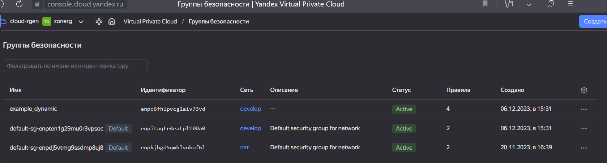

# Домашнее задание к занятию «Управляющие конструкции в коде Terraform»

## Чек-лист готовности к домашнему заданию
* 1. Зарегистрирован аккаунт в Yandex Cloud. Использован промокод на грант.
[Урок02](https://github.com/R-Gennadi/devops-netology/blob/main/Terra/Terr_2.md "Ранее было представлено")

* 2. Установлен инструмент Yandex CLI.
[Урок02](https://github.com/R-Gennadi/devops-netology/blob/main/Terra/Terr_2.md "Ранее было представлено")

* 3.  Доступен исходный код для выполнения задания в директории 03/src

```bash
ubuntu@ubuntu2004:~/cloud$ ls -Ra 03
03:
.  ..  03

03/03:
.  ..  demonstration2  demostration1.tf  hw-03.md  src

03/03/demonstration2:
.  ..  .gitignore  hosts.tftpl  main.tf  personal.auto.tfvars_example  test.yml  variables.tf

03/03/src:
.  ..  .gitignore  main.tf  providers.tf  security.tf  terraformrc  variables.tf
```    
* 4.  Любые ВМ, использованные при выполнении задания, должны быть прерываемыми, для экономии средств.
> принято


## Задание 0
* 1. Ознакомьтесь с документацией к security-groups в Yandex Cloud.
[Урок02](https://github.com/R-Gennadi/devops-netology/blob/main/Terra/Terr_2.md "Ранее было представлено")

* 2. Запросите preview-доступ к этому функционалу в личном кабинете Yandex Cloud. 
[Урок02](https://github.com/R-Gennadi/devops-netology/blob/main/Terra/Terr_2.md "Ранее было представлено")


## Задание 1
Приложите скриншот входящих правил «Группы безопасности» в ЛК Yandex Cloud или скриншот отказа в предоставлении доступа к preview-версии.


## Задание 2


## Задание 3


## Задание 4