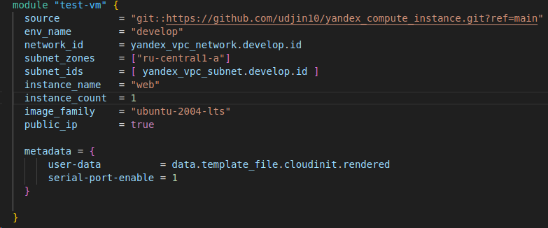

# Домашнее задание к занятию «Продвинутые методы работы с Terraform»

## Чек-лист готовности к домашнему заданию
>"Ранее было представлено" [Урок02](https://github.com/R-Gennadi/devops-netology/blob/main/Terra/Terr_2.md "Ранее было представлено")

## Задание 1
* 1. Возьмите из демонстрации к лекции готовый код для создания ВМ с помощью remote-модуля.
    
>результат 

* 2.  Создайте одну ВМ, используя этот модуль. В файле cloud-init.yml необходимо использовать переменную для ssh-ключа вместо хардкода. 
Передайте ssh-ключ в функцию template_file в блоке vars ={} . Воспользуйтесь примером. Обратите внимание, 
что ssh-authorized-keys принимает в себя список, а не строку.

>результат 

* 3. Добавьте в файл cloud-init.yml установку nginx.

* 4.  Предоставьте скриншот подключения к консоли и вывод команды sudo nginx -t.

 Листинг кода заданиям 1 по [ссылке](files_4%2Fscr%2Fset_1)

## Задание 2
* 1. Напишите локальный модуль vpc, который будет создавать 2 ресурса: одну сеть и одну подсеть в зоне, 
объявленной при вызове модуля, например: ru-central1-a.

* 2.  Вы должны передать в модуль переменные с названием сети, zone и v4_cidr_blocks.

* 3. Модуль должен возвращать в root module с помощью output информацию о yandex_vpc_subnet. 
Пришлите скриншот информации из terraform console о своем модуле. Пример: > module.vpc_dev

* 4.  Замените ресурсы yandex_vpc_network и yandex_vpc_subnet созданным модулем. 
Не забудьте передать необходимые параметры сети из модуля vpc в модуль с виртуальной машиной.

* 5. Откройте terraform console и предоставьте скриншот содержимого модуля. Пример: > module.vpc_dev.

* 6.  Сгенерируйте документацию к модулю с помощью terraform-docs.
 
[readmy.md](files_4%2Fscr%2Fset_2%2Freadmy.md)

> Листинг кода заданиям 2 по [ссылке](files_4%2Fscr%2Fset_2)

## Задание 3
* 1. Выведите список ресурсов в стейте

* 2.  Полностью удалите из стейта модуль vpc.

* 3. Полностью удалите из стейта модуль vm.

* 4.  Импортируйте всё обратно. Проверьте terraform plan. 
 Приложите список выполненных команд и скриншоты процессы.

> import network

> import subnet

 
> import compute
 

Изменений быть не должно.

