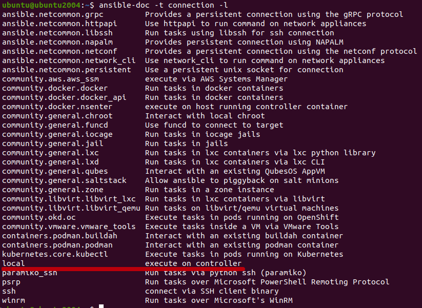
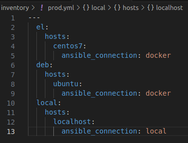

# Домашнее задание к занятию 1 «Введение в Ansible»

#### Подготовка к выполнению
<details><summary>.</summary>

1. Установите ansible версии 2.10 или выше.
2. Создайте свой собственный публичный репозиторий на github с произвольным именем.
3. Скачайте [playbook](playbook/) из репозитория с домашним заданием и перенесите его в свой репозиторий.

</details>  
>результат 
```bash
ubuntu@ubuntu2004:~$ ansible --version
ansible [core 2.13.13]
  config file = /etc/ansible/ansible.cfg
  configured module search path = ['/home/ubuntu/.ansible/plugins/modules', '/usr/share/ansible/plugins/modules']
  ansible python module location = /home/ubuntu/.local/lib/python3.8/site-packages/ansible
  ansible collection location = /home/ubuntu/.ansible/collections:/usr/share/ansible/collections
  executable location = /home/ubuntu/.local/bin/ansible
  python version = 3.8.10 (default, Nov 22 2023, 10:22:35) [GCC 9.4.0]
  jinja version = 3.1.2
  libyaml = True
```

## Основная часть

* 1. Попробуйте запустить playbook на окружении из test.yml,
 зафиксируйте значение, которое имеет факт some_fact для указанного хоста при выполнении playbook.
>результат 
```bash
ubuntu@ubuntu2004:~/cloud/test$ ansible-playbook site.yml -i inventory/test.yml

PLAY [Print os facts] ************************************************************************************************************************************

TASK [Gathering Facts] ***********************************************************************************************************************************
ok: [localhost]

TASK [Print OS] ******************************************************************************************************************************************
ok: [localhost] => {
    "msg": "Ubuntu"
}

TASK [Print fact] ****************************************************************************************************************************************
ok: [localhost] => {
    "msg": 12
}

PLAY RECAP ***********************************************************************************************************************************************
localhost                  : ok=3    changed=0    unreachable=0    failed=0    skipped=0    rescued=0    ignored=0  
```

* 2. Найдите файл с переменными (group_vars), в котором задаётся найденное в первом пункте значение, и поменяйте его на all default fact.

>результат 
```bash
ubuntu@ubuntu2004:~/cloud/test$ ansible-playbook -i inventory/test.yml site.yml

PLAY [Print os facts] ********************************************************************************************************************************************************************************

TASK [Gathering Facts] *******************************************************************************************************************************************************************************
ok: [localhost]

TASK [Print OS] **************************************************************************************************************************************************************************************
ok: [localhost] => {
    "msg": "Ubuntu"
}

TASK [Print fact] ************************************************************************************************************************************************************************************
ok: [localhost] => {
    "msg": "all default fact"
}

PLAY RECAP *******************************************************************************************************************************************************************************************
localhost                  : ok=3    changed=0    unreachable=0    failed=0    skipped=0    rescued=0    ignored=0   
```

* 3. Воспользуйтесь подготовленным (используется docker) или создайте собственное окружение для проведения дальнейших испытаний.
>результат 
```bash
ubuntu@ubuntu2004:~/cloud/test$ docker ps
CONTAINER ID   IMAGE                 COMMAND            CREATED              STATUS              PORTS     NAMES
ac606fa2c033   pycontribs/ubuntu     "sleep 65000000"   51 seconds ago       Up 50 seconds                 ubuntu
957de361cafe   pycontribs/centos:7   "sleep 36000000"   About a minute ago   Up About a minute             centos7
```

* 4. Проведите запуск playbook на окружении из prod.yml. Зафиксируйте полученные значения some_fact для каждого из managed host.

>результат 
```bash
ubuntu@ubuntu2004:~/cloud/test$ ansible-playbook -i inventory/prod.yml site.yml

PLAY [Print os facts] ********************************************************************************************************************************************************************************

TASK [Gathering Facts] *******************************************************************************************************************************************************************************
ok: [ubuntu]
ok: [centos7]

TASK [Print OS] **************************************************************************************************************************************************************************************
ok: [centos7] => {
    "msg": "CentOS"
}
ok: [ubuntu] => {
    "msg": "Ubuntu"
}

TASK [Print fact] ************************************************************************************************************************************************************************************
ok: [ubuntu] => {
    "msg": "deb"
}
ok: [centos7] => {
    "msg": "el"
}

PLAY RECAP *******************************************************************************************************************************************************************************************
centos7                    : ok=3    changed=0    unreachable=0    failed=0    skipped=0    rescued=0    ignored=0   
ubuntu                     : ok=3    changed=0    unreachable=0    failed=0    skipped=0    rescued=0    ignored=0   
 ```

* 5. Добавьте факты в group_vars каждой из групп хостов так, чтобы для some_fact получились значения: для deb — deb default fact, для el — el default fact.
>результат 
```bash
ubuntu@ubuntu2004:~/cloud/test$ cat group_vars/deb/examp.yml ;echo ""
---
  some_fact: "deb default fact"
ubuntu@ubuntu2004:~/cloud/test$ cat group_vars/el/examp.yml ;echo ""
---
  some_fact: "el default fact"
 ```

* 6. Повторите запуск playbook на окружении prod.yml. Убедитесь, что выдаются корректные значения для всех хостов.
>результат 
```bash
buntu@ubuntu2004:~/cloud/test$ ansible-playbook -i inventory/prod.yml site.yml

PLAY [Print os facts] ********************************************************************************************************************************************************************************

TASK [Gathering Facts] *******************************************************************************************************************************************************************************
ok: [ubuntu]
ok: [centos7]

TASK [Print OS] **************************************************************************************************************************************************************************************
ok: [centos7] => {
    "msg": "CentOS"
}
ok: [ubuntu] => {
    "msg": "Ubuntu"
}

TASK [Print fact] ************************************************************************************************************************************************************************************
ok: [centos7] => {
    "msg": "el default fact"
}
ok: [ubuntu] => {
    "msg": "deb default fact"
}

PLAY RECAP *******************************************************************************************************************************************************************************************
centos7                    : ok=3    changed=0    unreachable=0    failed=0    skipped=0    rescued=0    ignored=0   
ubuntu                     : ok=3    changed=0    unreachable=0    failed=0    skipped=0    rescued=0    ignored=0   
```

* 7. При помощи ansible-vault зашифруйте факты в group_vars/deb и group_vars/el с паролем netology.
>результат 
```bash
ubuntu@ubuntu2004:~/cloud/test$ ansible-vault encrypt group_vars/deb/examp.yml
New Vault password: 
Confirm New Vault password: 
Encryption successful
ubuntu@ubuntu2004:~/cloud/test$ cat group_vars/deb/examp.yml ;echo ""
$ANSIBLE_VAULT;1.1;AES256
65643865396234383062353936353239636665323731646232343237333135323366363934393832
3763333537343664363861663235633736646566363531640a643630383339336332653864616133
35393165393434643261343838633032383231656337663837326461313530613434653663623137
3730393939383736390a366364313664333031383636393830633432346264636363316339616638
65396332306532616236316366353534393434336432323639303536646663363166383530346566
6133313063633632643938323663306432623765356637383161
```
```bash
ubuntu@ubuntu2004:~/cloud/test$ ansible-vault encrypt group_vars/el/examp.yml
New Vault password: 
Confirm New Vault password: 
Encryption successful
ubuntu@ubuntu2004:~/cloud/test$ cat group_vars/el/examp.yml ;echo ""
$ANSIBLE_VAULT;1.1;AES256
39663431633464633964346632303332663064363537323738313065616165326566386162616561
3438616531666264326463663164336133636561303435640a383033316338623662623966326364
66633563393961383737353239393162386461666131366135366331656138396335303733303237
3262663737333939360a363430613663313739393932656465653035663536326139626161653064
39336539383535373065333434376565386233373937386238346365366439366565333261336335
3361373431353062333238663266653365383863653237643339
```
* 8. Запустите playbook на окружении prod.yml. При запуске ansible должен запросить у вас пароль. Убедитесь в работоспособности.
>результат 
```bash
ubuntu@ubuntu2004:~/cloud/test$ ansible-playbook -i inventory/prod.yml site.yml --ask-vault-pass
Vault password: 

PLAY [Print os facts] ********************************************************************************************************************************************************************************

TASK [Gathering Facts] *******************************************************************************************************************************************************************************
ok: [ubuntu]
ok: [centos7]

TASK [Print OS] **************************************************************************************************************************************************************************************
ok: [centos7] => {
    "msg": "CentOS"
}
ok: [ubuntu] => {
    "msg": "Ubuntu"
}

TASK [Print fact] ************************************************************************************************************************************************************************************
ok: [centos7] => {
    "msg": "el default fact"
}
ok: [ubuntu] => {
    "msg": "deb default fact"
}

PLAY RECAP *******************************************************************************************************************************************************************************************
centos7                    : ok=3    changed=0    unreachable=0    failed=0    skipped=0    rescued=0    ignored=0   
ubuntu                     : ok=3    changed=0    unreachable=0    failed=0    skipped=0    rescued=0    ignored=0   
```

* 9. Посмотрите при помощи ansible-doc список плагинов для подключения. Выберите подходящий для работы на control node.
>результат 


* 10. В prod.yml добавьте новую группу хостов с именем local, в ней разместите localhost с необходимым типом подключения.

>результат 


* 11. Запустите playbook на окружении prod.yml. При запуске ansible должен запросить у вас пароль. 
Убедитесь, что факты some_fact для каждого из хостов определены из верных group_vars.
>результат 
```bash
ubuntu@ubuntu2004:~/cloud/test$ ansible-playbook -i inventory/prod.yml site.yml --ask-vault-pass
Vault password: 

PLAY [Print os facts] ********************************************************************************************************************************************************************************

TASK [Gathering Facts] *******************************************************************************************************************************************************************************
ok: [ubuntu]
ok: [localhost]
ok: [centos7]

TASK [Print OS] **************************************************************************************************************************************************************************************
ok: [centos7] => {
    "msg": "CentOS"
}
ok: [ubuntu] => {
    "msg": "Ubuntu"
}
ok: [localhost] => {
    "msg": "Ubuntu"
}

TASK [Print fact] ************************************************************************************************************************************************************************************
ok: [ubuntu] => {
    "msg": "deb default fact"
}
ok: [centos7] => {
    "msg": "el default fact"
}
ok: [localhost] => {
    "msg": "all default fact"
}

PLAY RECAP *******************************************************************************************************************************************************************************************
centos7                    : ok=3    changed=0    unreachable=0    failed=0    skipped=0    rescued=0    ignored=0   
localhost                  : ok=3    changed=0    unreachable=0    failed=0    skipped=0    rescued=0    ignored=0   
ubuntu                     : ok=3    changed=0    unreachable=0    failed=0    skipped=0    rescued=0    ignored=0   
```

* 12. Заполните README.md ответами на вопросы. Сделайте git push в ветку master. 
В ответе отправьте ссылку на ваш открытый репозиторий с изменённым playbook и заполненным README.md.

[изменённый playbook](playbook)

* 13. Предоставьте скриншоты результатов запуска команд.