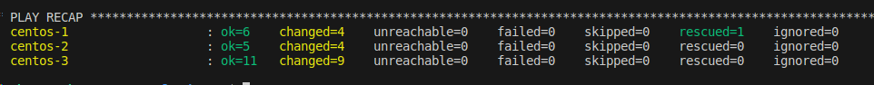
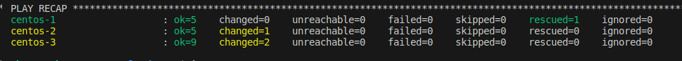

# Домашнее задание к занятию 3 «Использование Ansible»

## Подготовка к выполнению

1. Подготовьте в Yandex Cloud три хоста: для `clickhouse`, для `vector` и для `lighthouse`.
>результат 
> 
Создано 3 виртуальные машины в Yandex.Cloud с использованием Terraform.
[Terraform](https://github.com/R-Gennadi/devops-netology/tree/main/ansible/03-yandex/files/terraform "Код Terraform")

2. Репозиторий LightHouse находится ...
>результат
> 
Изучен мануал

## Основная часть

1. Допишите playbook: нужно сделать ещё один play, который устанавливает и настраивает LightHouse.
2. При создании tasks рекомендую использовать модули: `get_url`, `template`, `yum`, `apt`.
3. Tasks должны: скачать статику LightHouse, установить Nginx или любой другой веб-сервер, настроить его конфиг для открытия LightHouse, запустить веб-сервер.
>результат
> 
 Дописан play, который устанавливает LightHouse. 
 Используя модули get_url, template, yum, service, file:
 Происходит установка и конфигурирование веб-сервера Nginx, установка и конфигурирование LightHouse, запуск служб Nginx и LightHouse.

4. Подготовьте свой inventory-файл `prod.yml`.
>результат
> 
```bash
ubuntu@ubuntu2004:~/cloud/test/inventory$ cat prod.yml

---
clickhouse:
  hosts:
    centos-1:
      ansible_host: 158.160.121.120
vector:
  hosts:
    centos-2:
      ansible_host: 158.160.97.44
lighthouse:
  hosts:
    centos-3:
      ansible_host: 158.160.114.41
``` 

5. Запустите `ansible-lint site.yml` и исправьте ошибки, если они есть.
>результат
> 
При запуске ansible-lint site.yml 
 ошибки в использовании старых наименований модулей, 
 отсутствии прав на скачиваемые или создаваемые файлы. 
 Ошибки исправлены.

6. Попробуйте запустить playbook на этом окружении с флагом `--check`.
>результат
>
Запуск playbook с флагом --check происходит без изменений в конечную систему. 
Выполнение плейбука полноценно невозможно с этим флагом, т.к. нет скачанных файлов дистрибутива, а значит не сможет  устанавливиться

7. Запустите playbook на `prod.yml` окружении с флагом `--diff`. Убедитесь, что изменения на системе произведены.
>результат
>


8. Повторно запустите playbook с флагом `--diff` и убедитесь, что playbook идемпотентен.
>результат
>
Повторный запуск playbook с флагом --diff. 
Playbook идемпотентен, 
изменения связаны с перезапуском сервиса Vector и клонировниеv git


9. Подготовьте README.md-файл по своему playbook. В нём должно быть описано: что делает playbook, какие у него есть параметры и теги.
>результат
>
[README.md](https://github.com/R-Gennadi/devops-netology/blob/main/ansible/03-yandex/files/playbook/README.md "описание playbook")

11. Готовый playbook выложите в свой репозиторий, поставьте тег `08-ansible-03-yandex` на фиксирующий коммит, в ответ предоставьте ссылку на него.
>результат
>
Выполнено

---

