# Домашнее задание к занятию 9 «Процессы CI/CD»

## Подготовка к выполнению

<details> <summary> . </summary>

1. Создайте два VM в Yandex Cloud с параметрами: 2CPU 4RAM Centos7 (остальное по минимальным требованиям).
2. Пропишите в [inventory] созданные хосты.
3. Добавьте в [files] файл со своим публичным ключом (id_rsa.pub). Если ключ называется иначе — найдите таску в плейбуке, которая использует id_rsa.pub имя, и исправьте на своё.
4. Запустите playbook, ожидайте успешного завершения.
5. Проверьте готовность SonarQube через [браузер].
6. Зайдите под admin\admin, поменяйте пароль на свой.
7. Проверьте готовность Nexus через [бразуер].
8. Подключитесь под admin\admin123, поменяйте пароль, сохраните анонимный доступ.
</details>

> ### Результат:
> 
1 Для создания 2х виртуальныех машин в Yandex.Cloud использовал Terraform,
[Terraform](files%2Fterraform "Код Terraform")
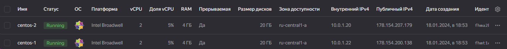 

2 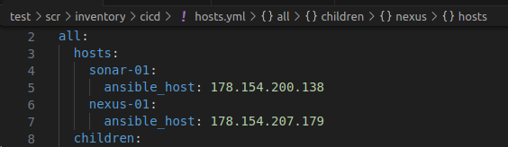

3 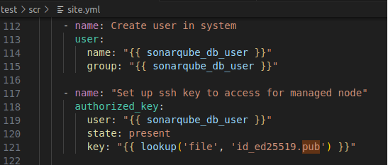 

4 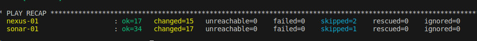

5 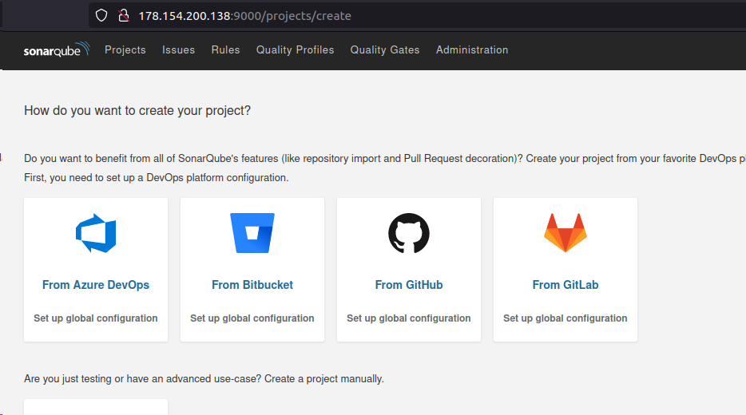

7 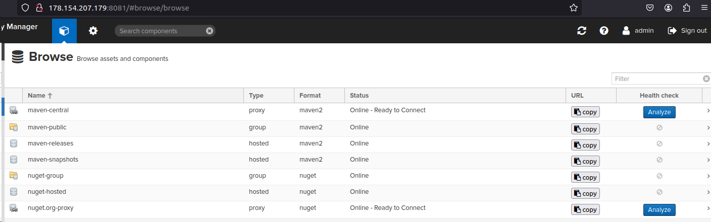


## Знакомоство с SonarQube
<details> <summary> ### Основная часть </summary>

1. Создайте новый проект, название произвольное.
2. Скачайте пакет sonar-scanner, который вам предлагает скачать SonarQube.
3. Сделайте так, чтобы binary был доступен через вызов в shell (или поменяйте переменную PATH, или любой другой, удобный вам способ).
4. Проверьте `sonar-scanner --version`.
5. Запустите анализатор против кода из директории [example] с дополнительным ключом `-Dsonar.coverage.exclusions=fail.py`.
6. Посмотрите результат в интерфейсе.
7. Исправьте ошибки, которые он выявил, включая warnings.
8. Запустите анализатор повторно — проверьте, что QG пройдены успешно.
9. Сделайте скриншот успешного прохождения анализа, приложите к решению ДЗ.
</details>

> ### Результат:
> 
1-4 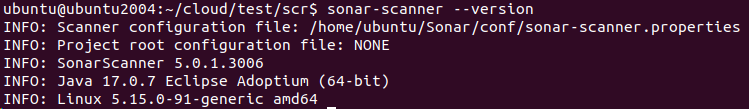

5 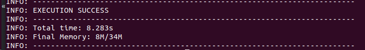

6 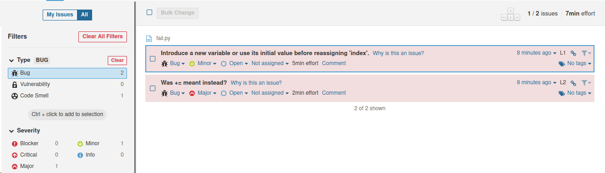

7-8 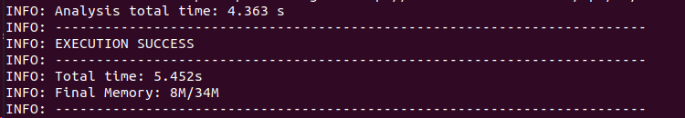

9 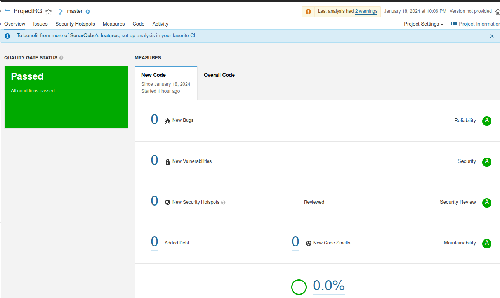

## Знакомство с Nexus
<details> <summary> ### Основная часть </summary>
1. В репозиторий `maven-public` загрузите артефакт с GAV-параметрами:
 *    groupId: netology;
 *    artifactId: java;
 *    version: 8_282;
 *    classifier: distrib;
 *    type: tar.gz.
2. В него же загрузите такой же артефакт, но с version: 8_102.
3. Проверьте, что все файлы загрузились успешно.
4. В ответе пришлите файл `maven-metadata.xml` для этого артефекта.
</details>

>  ### Результат:
>
1 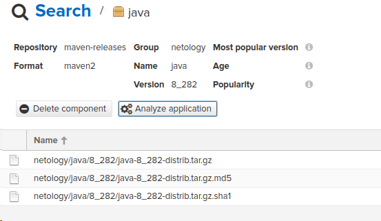

2 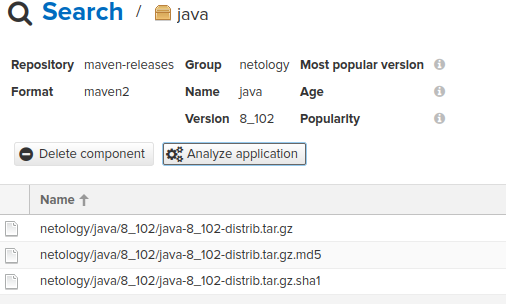

3 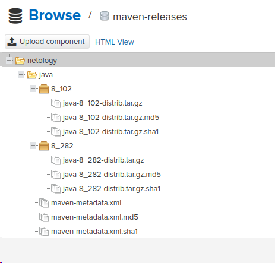

4 [maven-metadata.xml](files%2Fmaven-metadata.xml)

### Знакомство с Maven
<details> <summary> ### Подготовка к выполнению </summary>

1. Скачайте дистрибутив с [maven]
2. Разархивируйте, сделайте так, чтобы binary был доступен через вызов в shell (или поменяйте переменную PATH, или любой другой, удобный вам способ).
3. Удалите из `apache-maven-<version>/conf/settings.xml` упоминание о правиле, отвергающем HTTP- соединение — раздел mirrors —> id: my-repository-http-unblocker.
4. Проверьте `mvn --version`.
5. Заберите директорию [mvn] с pom.
</details>

>  ### Результат:
>

1-4
```bash
ubuntu@ubuntu2004:~/cloud/test$ mvn --version
Apache Maven 3.9.6 (bc0240f3c744dd6b6ec2920b3cd08dcc295161ae)
Maven home: /home/ubuntu/maven
Java version: 1.8.0_392, vendor: Private Build, runtime: /usr/lib/jvm/java-8-openjdk-amd64/jre
Default locale: ru_RU, platform encoding: UTF-8
OS name: "linux", version: "5.15.0-91-generic", arch: "amd64", family: "unix"
```

5 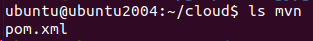

<details> <summary> ### Основная часть </summary>

1. Поменяйте в `pom.xml` блок с зависимостями под ваш артефакт из первого пункта задания для Nexus (java с версией 8_282).
2. Запустите команду `mvn package` в директории с `pom.xml`, ожидайте успешного окончания.
3. Проверьте директорию `~/.m2/repository/`, найдите ваш артефакт.
4. В ответе пришлите исправленный файл `pom.xml`.
</details>

>  ### Результат:
>

1 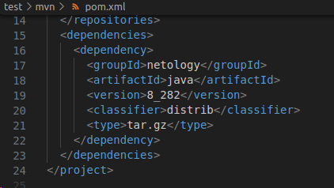 

2 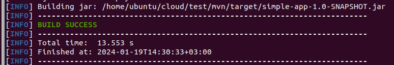

3 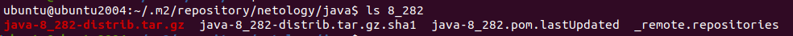

4 [pom.xml](files%2Fpom.xml)

---

