# Домашнее задание к занятию 10 «Jenkins»

<details> <summary> ## Подготовка к выполнению </summary>

1. Создать два VM: для jenkins-master и jenkins-agent.
2. Установить Jenkins при помощи playbook.
3. Запустить и проверить работоспособность.
4. Сделать первоначальную настройку.

</details>

> ### Результат:
> 
1. Для создания 2х виртуальныех машин в Yandex.Cloud использовал Terraform
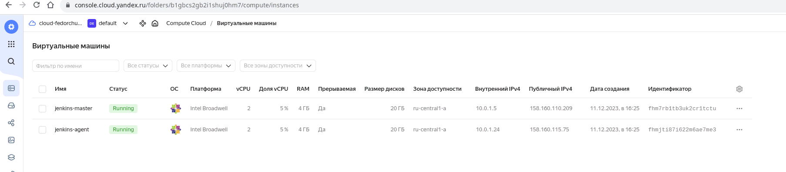

2. Установлен Jenkins при помощи playbook.
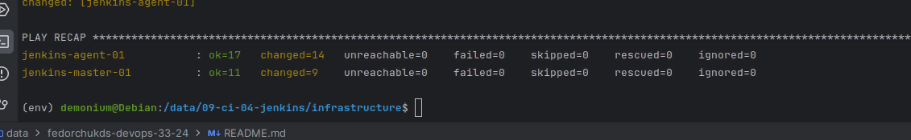

3. Запущен Jenkins, проверена его работоспособность.
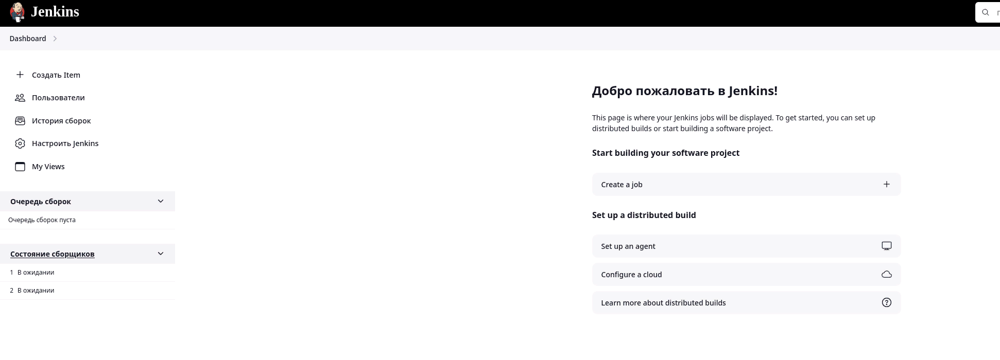

4. Сделана первоначальная настройка.
Подключен агент:
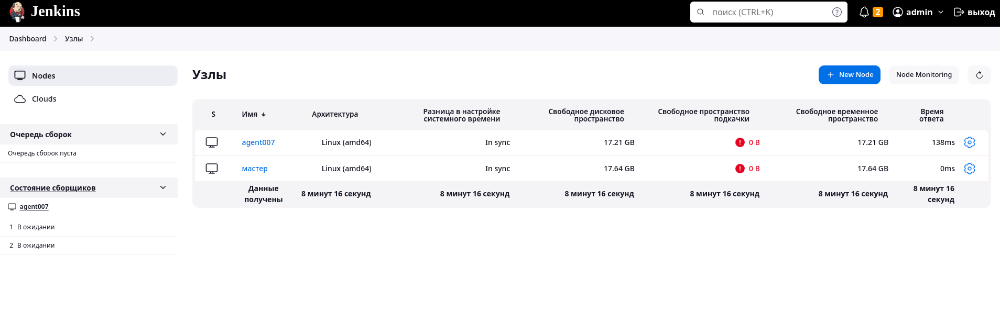

<details> <summary> ## Основная часть </summary>

1. Сделать Freestyle Job, который будет запускать `molecule test` из любого вашего репозитория с ролью.
2. Сделать Declarative Pipeline Job, который будет запускать `molecule test` из любого вашего репозитория с ролью.
3. Перенести Declarative Pipeline в репозиторий в файл `Jenkinsfile`.
4. Создать Multibranch Pipeline на запуск `Jenkinsfile` из репозитория.
5. Создать Scripted Pipeline, наполнить его скриптом из [pipeline]
6. Внести необходимые изменения, чтобы Pipeline запускал `ansible-playbook` без флагов `--check --diff`, если не
   установлен параметр при запуске джобы (prod_run = True). По умолчанию параметр имеет значение False и запускает
   прогон с флагами `--check --diff`.
7. Проверить работоспособность, исправить ошибки, исправленный Pipeline вложить в репозиторий в
   файл `ScriptedJenkinsfile`.
8. Отправить ссылку на репозиторий с ролью и Declarative Pipeline и Scripted Pipeline.
9. Сопроводите процесс настройки скриншотами для каждого пункта задания!!

</details>

> ### Результат:
>
1. Freestyle Job, запускает molecule test из моего [репозитория](https://github.com/R-Gennadi/devops-netology/tree/main/ansible/vector-role) с ролью vector-role:
В настройках сборки указан этот репозиторий:
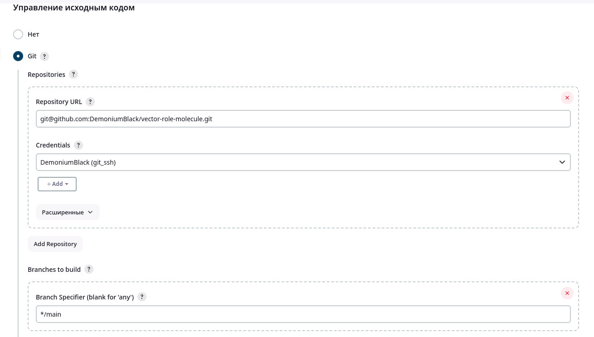

Выполняю следующие команды:
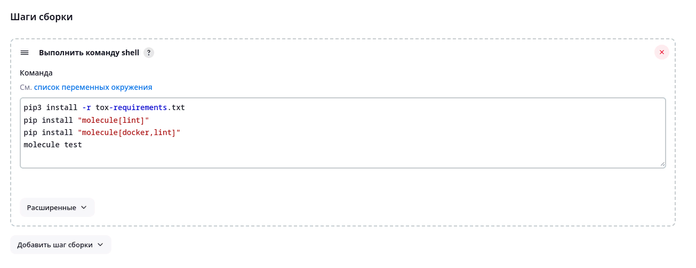

Успешная сборка:
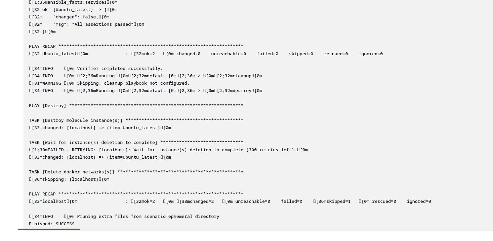

2. Declarative Pipeline Job, запускает molecule test из того же репозитория:
Выполнил следующий код:
```bash
pipeline {
    agent any

    stages {
        stage('GIT checkout') {
            steps {
                echo 'Get from GIT repository'
                git credentialsId: 'git_ssh', 
                url: 'git@github.com:DemoniumBlack/vector-role-molecule.git',
                branch: 'main'
            }
        }
        stage('preparation') {
            steps {
                echo 'Start preparation'
                sh 'pip3 install -r tox-requirements.txt'
                sh 'pip install "molecule[lint]"'
                sh 'pip install "molecule[docker,lint]"'
            }
        }
        stage('Start molecule test') {
            steps {
                echo 'Run molecule test'
                sh 'molecule test'
            }
        }
    }
}
```
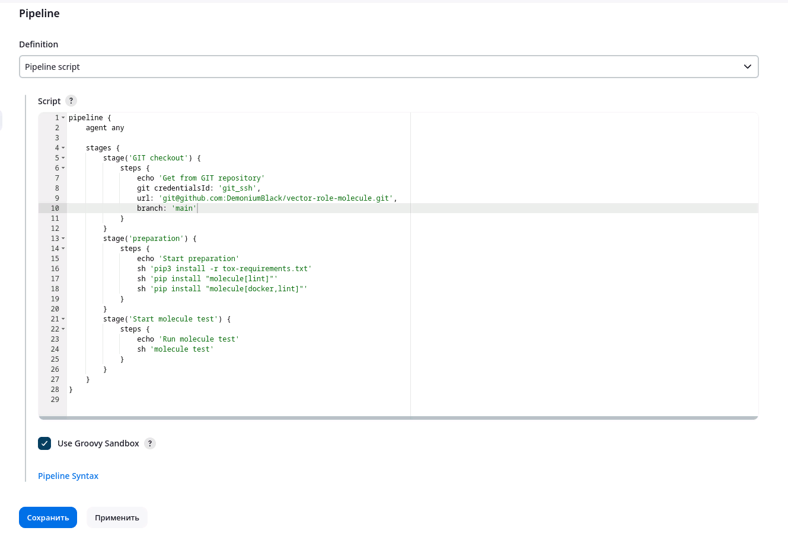

Успешная сборка:
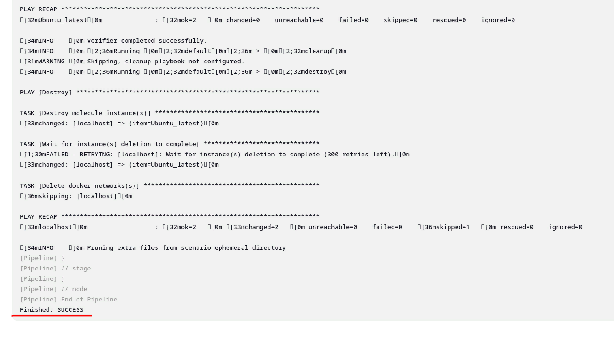

3. Declarative Pipeline перенесён в файл [Jenkinsfile](https://github.com/R-Gennadi/devops-netology/blob/main/ansible/vector-role/Jenkinsfile).

4. Multibranch Pipeline на запуск `Jenkinsfile` из репозитория.
Выполняю сканирование удаленного репозитория для поиска веток, обнаружения Jenkinsfile, проверки изменения репозитория или изменения Jenkinsfile. 
Результат сканирования:
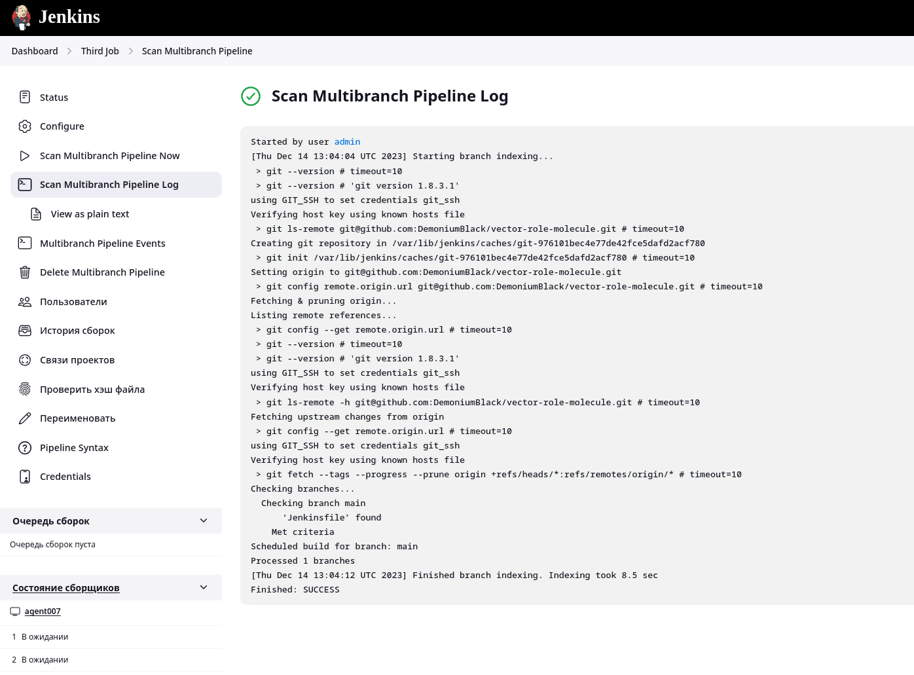

Сборка Multibranch Pipeline выполняется успешно:
5. Scripted Pipeline, наполнен скриптом из [files0](https://github.com/R-Gennadi/devops-netology/blob/main/ansible/vector-role/scripted/jenkinsfile/files0).
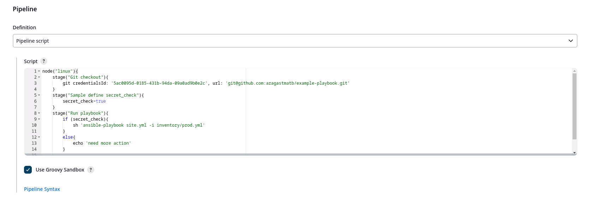

6. Внесены необходимые изменения, чтобы Pipeline запускал ansible-playbook без флагов --check --diff, если не установлен параметр при запуске джобы (prod_run = True).
Сборка без параметра prod_run = True запустилась без флага --check --diff:
 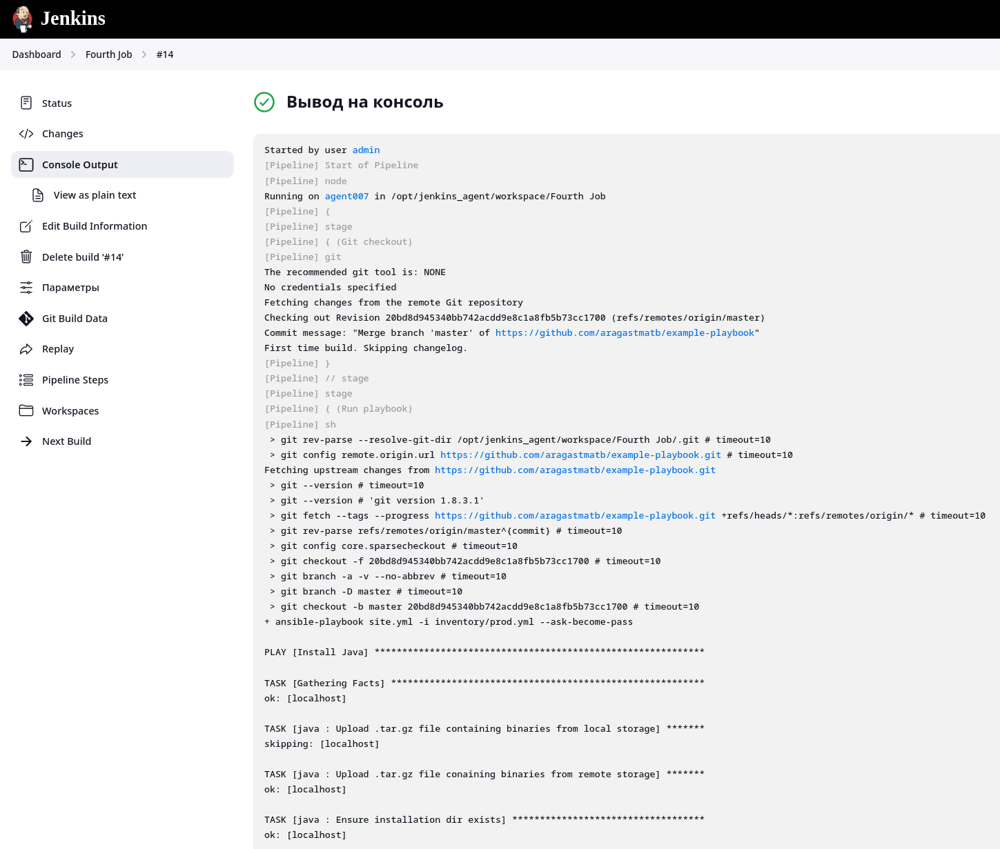
Сборка с параметром prod_run = True запустилась с флагом --check --diff:
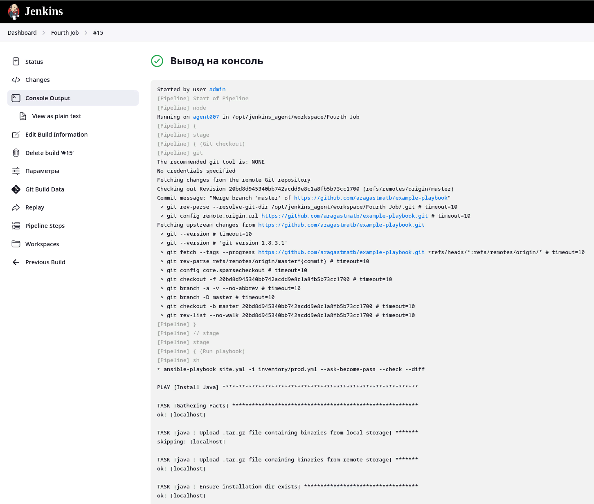

7.  Изменения внесенные в `files0` находятся в файле [files](https://github.com/R-Gennadi/devops-netology/blob/main/ansible/vector-role/scripted/jenkinsfile/files)

8. Репозиторий, на котором тестировался запуск Freestyle Job и Declarative Pipeline Job с запуском molecule test: (https://github.com/R-Gennadi/devops-netology/tree/main/ansible/vector-role)
Ссылка на Declarative Pipeline: (https://github.com/R-Gennadi/devops-netology/blob/main/ansible/vector-role/Jenkinsfile)

Ссылка на Scripted Pipeline: (https://github.com/R-Gennadi/devops-netology/blob/main/ansible/vector-role/scripted/jenkinsfile/files)

---