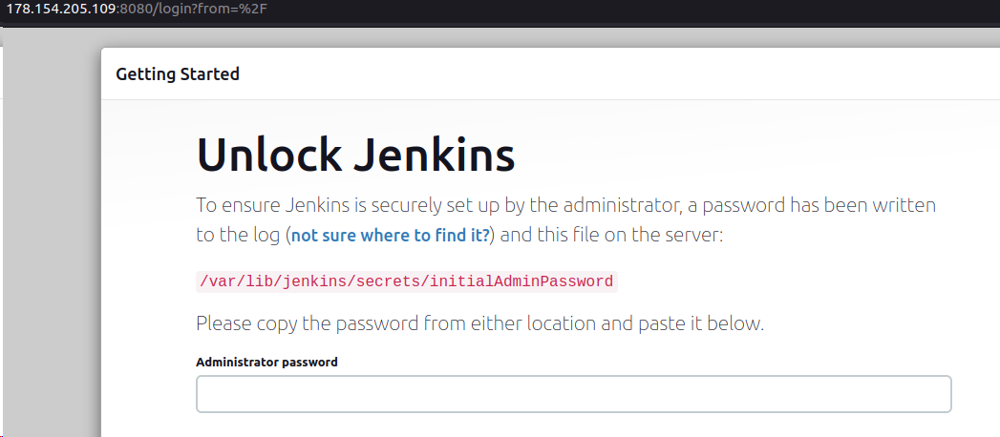
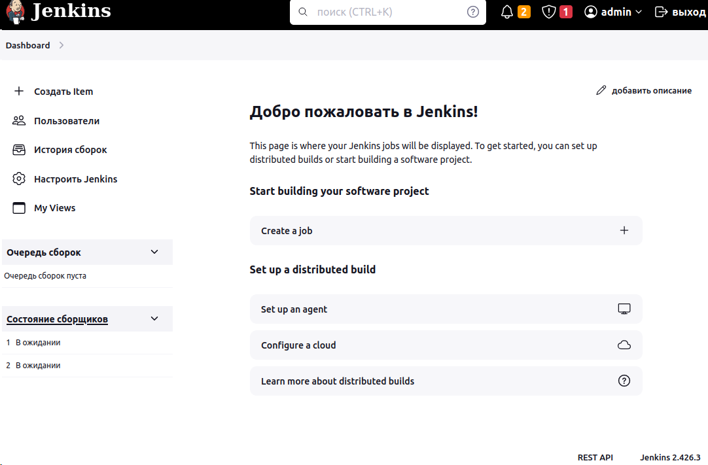
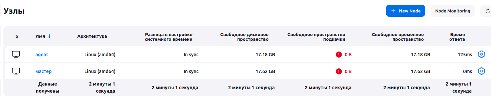
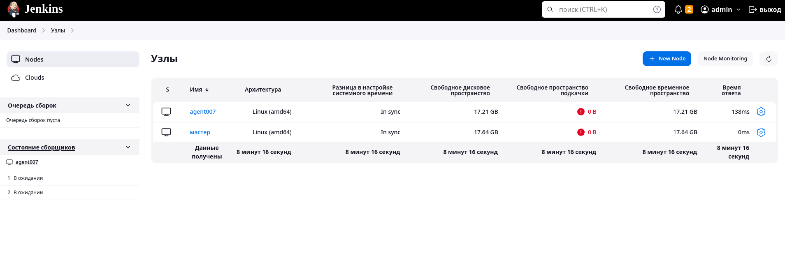

# Домашнее задание к занятию 10 «Jenkins»

 
 ## Подготовка к выполнению 

1. Создать два VM: для jenkins-master и jenkins-agent.
2. Установить Jenkins при помощи playbook.
3. Запустить и проверить работоспособность.
4. Сделать первоначальную настройку.

> ### Результат:
> 
1. Для создания 2х виртуальныех машин в Yandex.Cloud использовал Terraform

2. Установлен Jenkins при помощи playbook.

3. Запущен Jenkins, проверена его работоспособность.

4. Сделана первоначальная настройка.
Подключен агент:

 
 ## Основная часть 

1. Сделать Freestyle Job, который будет запускать `molecule test` из любого вашего репозитория с ролью.
2. Сделать Declarative Pipeline Job, который будет запускать `molecule test` из любого вашего репозитория с ролью.
3. Перенести Declarative Pipeline в репозиторий в файл `Jenkinsfile`.
4. Создать Multibranch Pipeline на запуск `Jenkinsfile` из репозитория.
5. Создать Scripted Pipeline, наполнить его скриптом из [pipeline]
6. Внести необходимые изменения, чтобы Pipeline запускал `ansible-playbook` без флагов `--check --diff`, если не
   установлен параметр при запуске джобы (prod_run = True). По умолчанию параметр имеет значение False и запускает
   прогон с флагами `--check --diff`.
7. Проверить работоспособность, исправить ошибки, исправленный Pipeline вложить в репозиторий в
   файл `ScriptedJenkinsfile`.
8. Отправить ссылку на репозиторий с ролью и Declarative Pipeline и Scripted Pipeline.
9. Сопроводите процесс настройки скриншотами для каждого пункта задания!!

> ### Результат:
>
1. Freestyle Job, запускает molecule test из моего репозитория с ролью vector-role:
2. Declarative Pipeline Job, запускает molecule test из того же репозитория:
3. Declarative Pipeline в файл Jenkinsfile.
4. Multibranch Pipeline на запуск Jenkinsfile из репозитория.
5. Scripted Pipeline, наполнен скриптом из pipeline.
6. Внесены необходимые изменения, чтобы Pipeline запускал ansible-playbook без флагов --check --diff, если не установлен параметр при запуске джобы (prod_run = True).
7. Изменения внесенные в Pipeline находятся в файле ScriptedJenkinsfile
8. Репозиторий, на котором тестировался запуск Freestyle Job и Declarative Pipeline Job с запуском molecule test:
Ссылка на Declarative Pipeline: https://github.com/DemoniumBlack/vector-role-molecule/blob/main/Jenkinsfile

Ссылка на Scripted Pipeline:

---