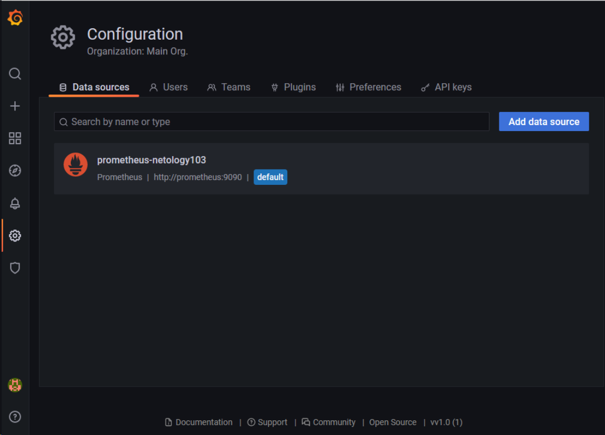
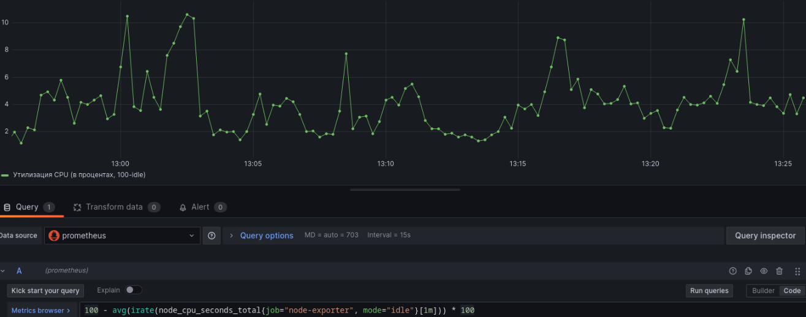
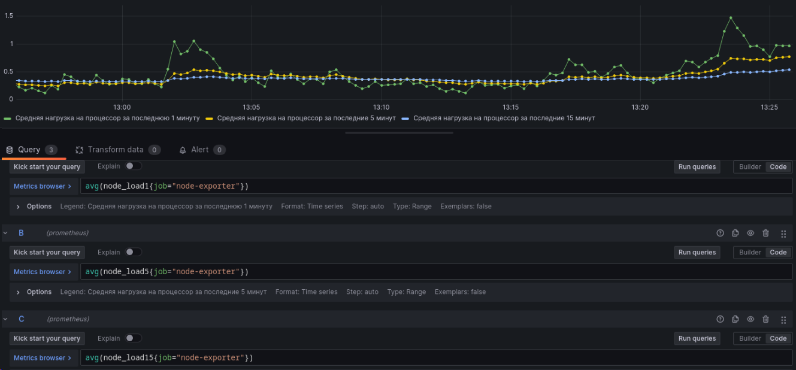
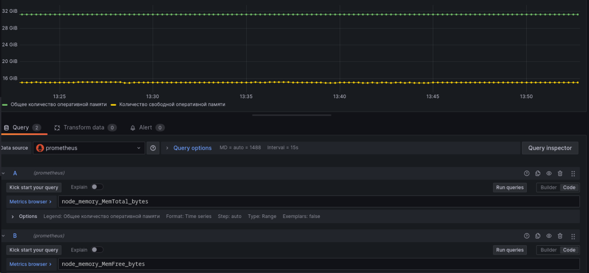
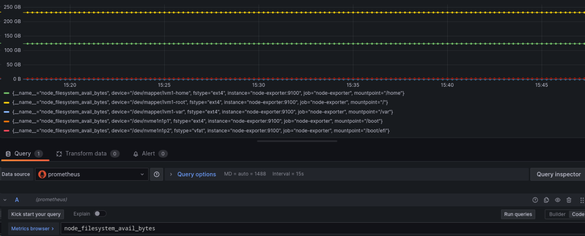
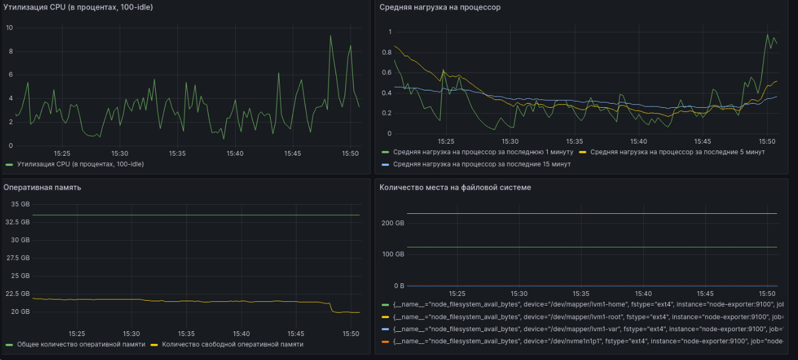
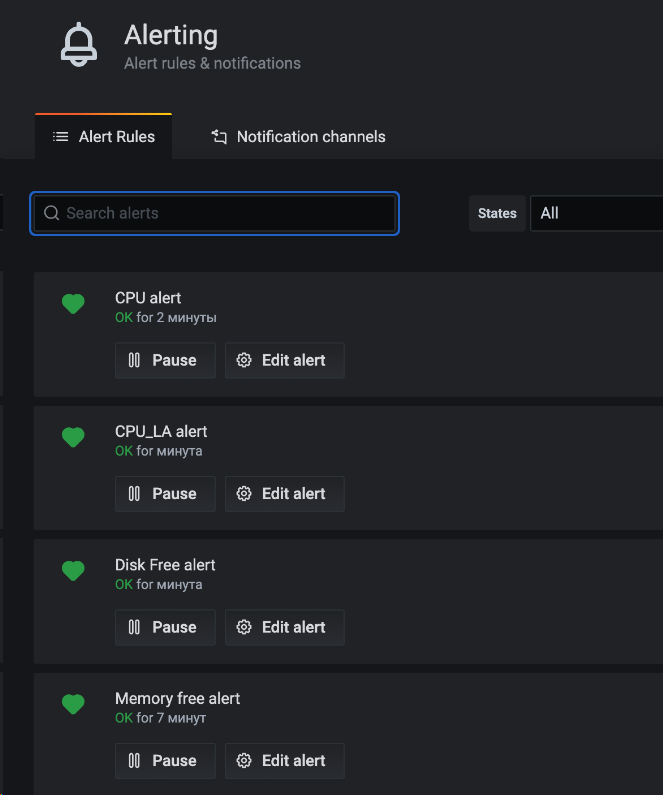
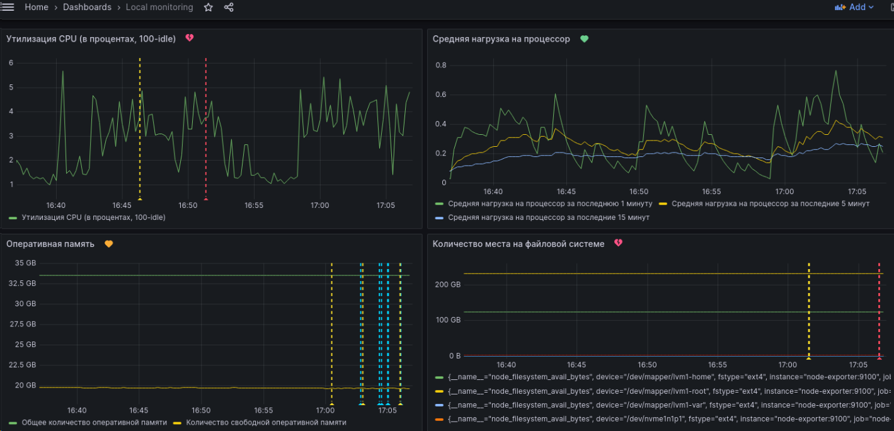

# Домашнее задание к занятию 14 «Средство визуализации Grafana»

## Обязательные задания
<details> <summary> . </summary>

## Задание 1
Используя директорию help внутри этого домашнего задания, запустите связку prometheus-grafana.
Зайдите в веб-интерфейс grafana, используя авторизационные данные, указанные в манифесте docker-compose.
Подключите поднятый вами prometheus, как источник данных.
Решение домашнего задания — скриншот веб-интерфейса grafana со списком подключенных Datasource.
#

## Задание 2
Изучите самостоятельно ресурсы:

PromQL tutorial for beginners and humans.
Understanding Machine CPU usage.
Introduction to PromQL, the Prometheus query language.
Создайте Dashboard и в ней создайте Panels:

утилизация CPU для nodeexporter (в процентах, 100-idle);
CPULA 1/5/15;
количество свободной оперативной памяти;
количество места на файловой системе.
Для решения этого задания приведите promql-запросы для выдачи этих метрик, а также скриншот получившейся Dashboard.
#

## Задание 3
Создайте для каждой Dashboard подходящее правило alert — можно обратиться к первой лекции в блоке «Мониторинг».
В качестве решения задания приведите скриншот вашей итоговой Dashboard.
#

## Задание 4
Сохраните ваш Dashboard. Для этого перейдите в настройки Dashboard, выберите в боковом меню «JSON MODEL». Далее скопируйте отображаемое json-содержимое в отдельный файл и сохраните его.
В качестве решения задания приведите листинг этого файла.

</details>

> ### Результат:
>
1.

#

2.  Dashboard c panels:
- утилизация CPU для node-exporter (в процентах, 100-idle):
```text
100 - avg(irate(node_cpu_seconds_total{job="node-exporter", mode="idle"}[1m])) * 100
```
Скриншот:


#

- CPULA 1/5/15:
```text
avg(node_load1{job="node-exporter"})
avg(node_load5{job="node-exporter"})
avg(node_load15{job="node-exporter"})
```
Скриншот:


#
 
- количество свободной оперативной памяти:
```text
node_memory_MemFree_bytes
```
Скриншот:


#
- количество места на файловой системе:
```text
node_filesystem_avail_bytes
```
Скриншот:



Общий скриншот Dashboard:


#

3.  

- Скриншот правил alert:


#

- скриншот итоговой Dashboard:



#

4. 

[Листинг](files/json/dashboard.json)

---
